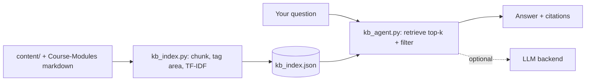

# Knowledge-Base Agent (Phase 1)

A retrieval agent over this site's knowledge base. It answers questions using
**your** authored content and course-module pages, and **cites the source page**
for every answer.

Phase 1 is intentionally simple and self-contained:

- **Pure Python standard library** — no external packages, no network, works
  behind the corporate proxy with zero setup.
- **TF-IDF retrieval** with cosine similarity.
- **Area filtering** — ask within `snowflake`, `dbt`, `databricks`, `rag`, etc.
  (this is the "different agents" idea, done as one engine + filters).
- **Pluggable LLM slot** — turn on Bedrock/OpenAI later for synthesized answers.

## Quick start

```powershell
cd agent
python ask.py --reindex                    # build the index (run after content changes)
python ask.py "What is Cortex Analyst?"     # one-shot, all areas
python ask.py --area snowflake "MERGE upsert pattern"
python ask.py                               # interactive chat loop
```

In the interactive loop: type a question, `/area snowflake` to filter, `/quit` to exit.

## How it works



- `kb_index.py` — builds `kb_index.json` from the markdown.
- `kb_agent.py` — retrieves and answers (extractive by default).
- `ask.py` — the CLI.

Authored prose in `content/` is weighted above the generated module file-list
pages, so answers favor real explanations.

## Phase 2 — enable an LLM (synthesized answers)

Extractive mode returns the best passages verbatim. Set `KB_LLM` (+ the relevant
SDK/creds) to get synthesized, conversational answers grounded in the same
retrieved context. Four backends are supported; `KB_LLM=auto` tries them in
order and uses the first available:

=== "Amazon Bedrock"

    ```powershell
    pip install boto3 --trusted-host pypi.org --trusted-host files.pythonhosted.org
    $env:KB_LLM = "bedrock"
    $env:AWS_REGION = "us-east-1"
    # optional: $env:KB_BEDROCK_MODEL = "anthropic.claude-3-5-sonnet-20240620-v1:0"
    python ask.py --area snowflake "Explain Cortex Search vs Analyst"
    ```

=== "OpenAI"

    ```powershell
    pip install openai --trusted-host pypi.org --trusted-host files.pythonhosted.org
    $env:KB_LLM = "openai"; $env:OPENAI_API_KEY = "sk-..."
    python ask.py "Explain Cortex Search vs Analyst"
    ```

=== "Azure OpenAI"

    ```powershell
    pip install openai --trusted-host pypi.org --trusted-host files.pythonhosted.org
    $env:KB_LLM = "azure"
    $env:AZURE_OPENAI_ENDPOINT = "https://<res>.openai.azure.com"
    $env:AZURE_OPENAI_API_KEY = "..."
    $env:AZURE_OPENAI_DEPLOYMENT = "<deployment-name>"
    python ask.py "..."
    ```

=== "Ollama (local, no key)"

    ```powershell
    # install Ollama, then: ollama pull llama3
    $env:KB_LLM = "ollama"; $env:KB_OLLAMA_MODEL = "llama3"
    python ask.py "..."
    ```

The LLM is always instructed to answer **only from retrieved context** and cite
sources. If the SDK/creds/service are missing, it silently falls back to
extractive mode (answers still work, just verbatim passages).

## Web API (FastAPI) — Phase 3 bridge

Expose the agent over HTTP so a chat box (or any client) can call it:

```powershell
pip install fastapi uvicorn --trusted-host pypi.org --trusted-host files.pythonhosted.org
uvicorn serve:app --reload      # from the agent/ folder
# open http://127.0.0.1:8000/docs  (interactive Swagger UI)
```

Endpoints: `GET /health`, `GET /areas`, `POST /ask {question, area?, k?}`,
`POST /reindex`. Set `KB_LLM` before launching to use an LLM backend.

## Roadmap

- **Phase 1 (done):** local retrieval + citations + area filter.
- **Phase 2 (done):** pluggable LLM backends (Bedrock/OpenAI/Azure/Ollama) +
  FastAPI `/ask` endpoint.
- **Phase 3 (next):** embed a chat box in the MkDocs site calling `/ask`.
- **Phase 4:** explicit, clearly-labeled web fallback when the KB has no answer.

## Notes

- Re-run `python ask.py --reindex` after you add/edit content.
- Scope stays on `content/` and course modules — no private/work data.
