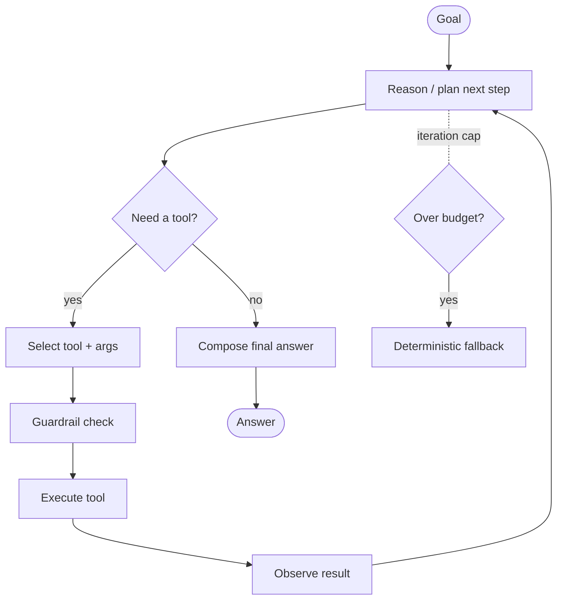
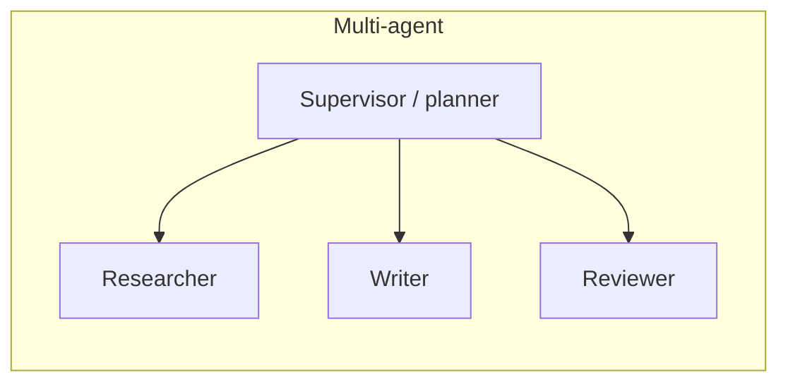

# Agent Workflow

How an LLM agent turns a goal into actions. For patterns and interview prep, see
[Agent Engineering](../../GenAI-Topics/agent-engineering/index.md).

## The control loop

## Anatomy

| Component | Role |
|-----------|------|
| **Planner/reasoner** | The LLM deciding the next step |
| **Tools** | Actions: search, DB query, API call (often via MCP) |
| **Memory** | Short-term (conversation) + long-term (facts) |
| **Guardrails** | Gate risky/irreversible actions |
| **Controller** | Iteration cap, cost budget, timeouts |
| **Tracer** | Logs every step for debugging/eval |

## Control & safety

- **Bound the loop** — max iterations + cost budget stop runaways.
- **Least-privilege tools** — separate read vs write; gate writes behind checks.
- **Human-in-the-loop** — approval before high-impact actions.
- **Deterministic fallback** — if the agent stalls, degrade to a fixed flow.
- **Trace everything** — you can't debug an agent you can't see.

## Single vs multi-agent

Start single-agent. Use a supervisor + specialists only when one agent's scope
and tools become unreliable — coordination adds latency and failure modes.

## Related

- [Agent Engineering](../../GenAI-Topics/agent-engineering/index.md)
  · [LangGraph](../../GenAI-Topics/langgraph/index.md)
  · [MCP](../../GenAI-Topics/mcp/index.md)
  · [AgentCore](../../GenAI-Topics/agentcore/index.md)
