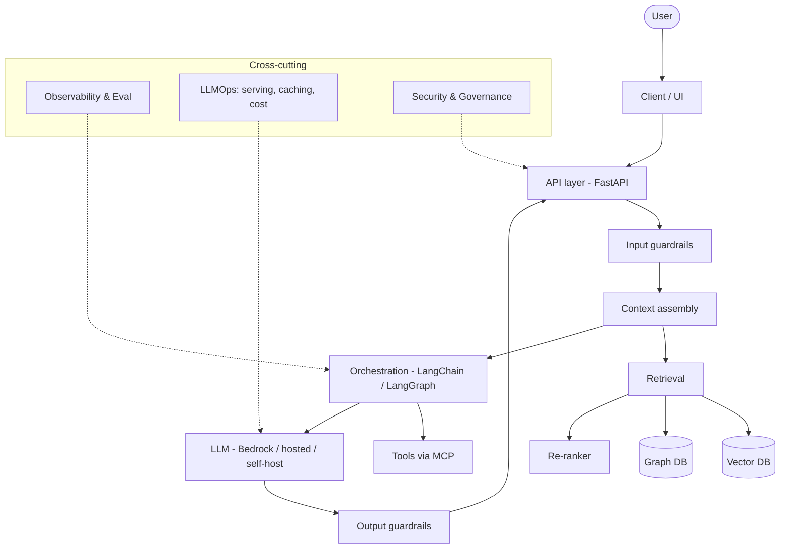
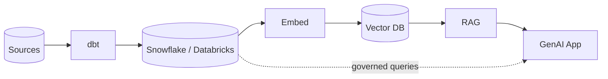

# Architecture Overview

A production GenAI application is a **pipeline**, not a single model call. This
page shows the layers, what each does, and where to read more.

## Reference architecture

## Layers explained

| Layer | Responsibility | Read more |
|-------|----------------|-----------|
| **Client / API** | Request handling, streaming, auth | [FastAPI](../../Technologies/fastapi/index.md) |
| **Guardrails** | Block injection, PII, unsafe I/O | [Security & Governance](../security-governance/index.md) |
| **Context assembly** | Budget the context window | [Context Engineering](../../GenAI-Topics/context-engineering/index.md) |
| **Retrieval** | Fetch grounding facts | [RAG](../../GenAI-Topics/rag/index.md), [Vector DB](../../GenAI-Topics/vector-db/index.md) |
| **Orchestration** | Chains / graphs / tools | [LangChain](../../GenAI-Topics/langchain/index.md), [LangGraph](../../GenAI-Topics/langgraph/index.md) |
| **Agent** | Plan/act/observe loop | [Agent Engineering](../../GenAI-Topics/agent-engineering/index.md) |
| **Model** | Generation | [LLM Fundamentals](../../GenAI-Topics/llm-fundamentals/index.md), [Bedrock](../../GenAI-Topics/bedrock/index.md) |
| **Observability** | Trace, eval, monitor | [Observability & Eval](../../GenAI-Topics/observability/index.md) |
| **LLMOps** | Serve, scale, cache, cost | [LLMOps](../../GenAI-Topics/llmops/index.md) |

## Design principles

- **Ground, don't guess** — retrieve facts; instruct "answer only from context."
- **Bound everything** — token budgets, iteration caps, timeouts, cost limits.
- **Least privilege** — especially for agent tools that take actions.
- **Observe from day one** — you can't improve what you can't trace.
- **Right-size the model** — smallest model that passes eval; route by difficulty.

## Where GenAI meets your data stack

GenAI doesn't replace the data platform — it sits on top. Retrieval reads from
governed stores; results write back to warehouses/lakes.

