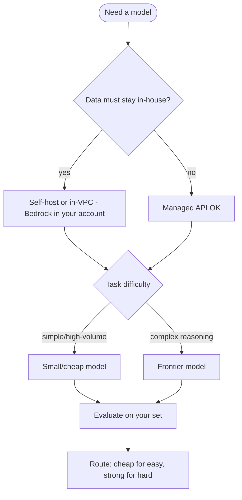

# Model Selection Guide

Choosing a model is a trade-off between **quality, cost, latency, context
window, and data governance**. This guide helps you decide systematically.

## Decision flow

## What to weigh

| Factor | Question |
|--------|----------|
| **Quality** | Does it pass your eval set on real tasks? |
| **Cost** | $ per 1K input/output tokens × your volume |
| **Latency** | Time-to-first-token and total; streaming? |
| **Context window** | Do your prompts/RAG fit? (bigger ≠ always better) |
| **Governance** | Where does data go? Region, PII, compliance |
| **Modality** | Text only, or vision/audio/tools? |
| **Customization** | Need fine-tuning / LoRA? |

## Practical strategy

1. **Start with a strong general model** to prove the use case works.
2. **Measure** quality on a labeled eval set (don't go by vibes).
3. **Down-size / route** — move easy queries to a cheaper model; keep the strong
   model for hard ones (**model routing**).
4. **Re-evaluate on upgrades** — models drift; pin versions and test before switching.

## Rule of thumb

- Prototyping → strong hosted model (fast to ship).
- Production, cost-sensitive, high volume → route + cache + right-size.
- Strict data control → in-VPC/self-host.
- Need knowledge → add **RAG**, don't fine-tune. Need behavior/style → fine-tune.

## Related

- [LLM Fundamentals](../../GenAI-Topics/llm-fundamentals/index.md)
  · [LLMOps](../../GenAI-Topics/llmops/index.md)
  · [Bedrock](../../GenAI-Topics/bedrock/index.md)
  · [Observability & Eval](../../GenAI-Topics/observability/index.md)
