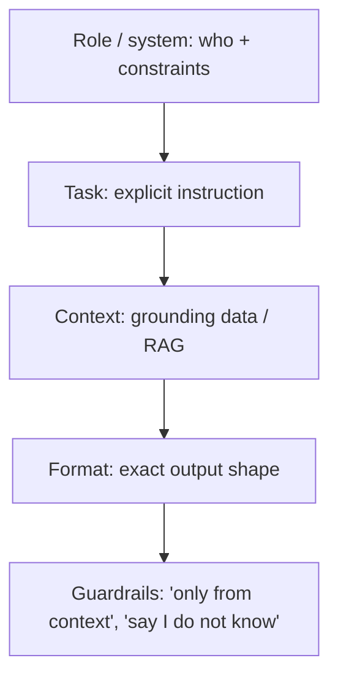

# Prompt Engineering Best Practices

Practical do's and don'ts for reliable prompts. For techniques and interview
prep, see [Prompt Engineering](../../GenAI-Topics/prompt-engineering/index.md).

## The anatomy of a good prompt

## Do

- **Be explicit** about the task, audience, and output format.
- **Show, don't tell** — give 1–3 examples (few-shot) to fix format/style.
- **Constrain output** — request strict JSON / a schema when code will parse it.
- **Ground and bound** — "answer only from the provided context; if unknown, say so."
- **Separate instructions from data** — never let retrieved/user text be read as commands.
- **Lower temperature** for factual/structured tasks.
- **Iterate with evals**, not vibes.

## Don't

- Vague asks with no format ("summarize this" — how long? for whom?).
- Cramming everything into one giant prompt (dilutes attention).
- Trusting the model to invent missing facts (→ hallucination).
- Contradictory few-shot examples.
- Ignoring prompt injection from documents/tools.

## Patterns cheat sheet

| Want | Use |
|------|-----|
| Simple known task | Zero-shot |
| Specific format/style | Few-shot examples |
| Multi-step reasoning | Chain-of-thought ("think step by step") |
| Tool use | ReAct (reason + act) |
| Parseable output | Structured output / function calling |
| Self-improvement | Reflection (draft → critique → revise) |

## Prompt-injection defense

Treat retrieved and user content as **untrusted data**:

- Keep system instructions clearly separated from context.
- Instruct the model to ignore instructions found inside data.
- Constrain tools with least privilege; validate tool inputs/outputs.
- Add output checks (PII, format, safety).

## Related

- [Prompt Engineering](../../GenAI-Topics/prompt-engineering/index.md)
  · [Context Engineering](../../GenAI-Topics/context-engineering/index.md)
  · [Security & Governance](../security-governance/index.md)
