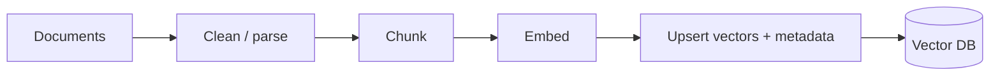
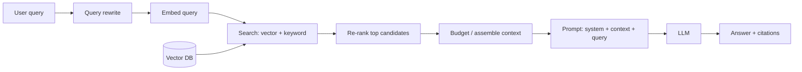

# RAG Flow

A step-by-step walkthrough of Retrieval-Augmented Generation — the indexing
phase (offline) and the query phase (online). For concepts and interview prep,
see the [RAG topic](../../GenAI-Topics/rag/index.md).

## Indexing (offline, once)

1. **Clean/parse** — extract text from PDFs/HTML/docs; strip noise.
2. **Chunk** — split into self-contained passages (heading/semantic, 10–20% overlap).
3. **Embed** — turn chunks into vectors with an embedding model.
4. **Upsert** — store vectors + **metadata** (source, date, tenant) in the vector DB.

## Query (online, per request)

1. **Query rewrite** — resolve follow-ups ("what about it?") into standalone queries.
2. **Embed query** — same model as indexing (must match).
3. **Hybrid search** — vector (semantic) + keyword (BM25), merged.
4. **Re-rank** — a cross-encoder orders the candidates by true relevance.
5. **Budget & assemble** — keep the top few, order them well, fit the token budget.
6. **Prompt** — system instructions + context + query; "answer only from context."
7. **Answer + citations** — return the grounded answer with sources.

## Where each step can fail

| Symptom | Likely step | Fix |
|---------|-------------|-----|
| Right docs not retrieved | Chunking / embedding / search | Better chunks, hybrid search, query rewrite |
| Retrieved but ignored | Prompt | Tighten "only from context", lower temp |
| Slow / expensive | Budget | Cap chunks/tokens, cache, re-rank fewer |
| Confidently wrong | Grounding | Require citations, add faithfulness eval |

## Related

- [RAG](../../GenAI-Topics/rag/index.md) · [Vector DB](../../GenAI-Topics/vector-db/index.md)
  · [Context Engineering](../../GenAI-Topics/context-engineering/index.md)
  · [Observability & Eval](../../GenAI-Topics/observability/index.md)
