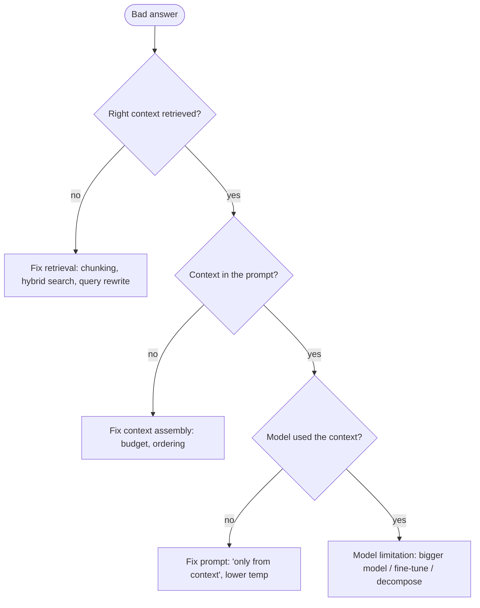

# Troubleshooting Guide

Common GenAI failure modes and how to diagnose them. The golden rule:
**trace the pipeline** — most "the model is dumb" problems are actually
retrieval, context, or prompt problems.

## Diagnosis flow

## Symptom → cause → fix

| Symptom | Likely cause | Fix |
|---------|-------------|-----|
| Confidently wrong (hallucination) | Missing/ignored grounding | Ground with RAG, "say I don't know", require citations, lower temp |
| Right docs not retrieved | Chunking / vocab mismatch | Better chunks, hybrid search, query rewrite, re-rank |
| Answers degrade in long chats | Context overflow | Compaction, sliding window, retrieval memory |
| Inconsistent JSON | Free-form output | Structured output / function calling + validation + retry |
| Agent loops / burns tokens | No control | Iteration cap, cost budget, clearer tools |
| Slow responses | Big model / big context | Route to smaller model, cache, trim context, stream |
| High cost | No routing/caching | Model routing, prompt caching, token budgets |
| Wrong tool called | Vague tool descriptions | Narrow, well-described, typed tools |
| Prompt injection | Untrusted content as instructions | Separate data/instructions, output checks, least privilege |

## Debugging checklist

1. **Look at the trace** — retrieved chunks, the exact prompt, tokens, tool calls.
2. **Isolate the layer** — retrieval vs context vs prompt vs model.
3. **Reproduce** with a fixed input; change one thing at a time.
4. **Add it to the eval set** so the fix is measured and doesn't regress.

## Related

- [Observability & Eval](../../GenAI-Topics/observability/index.md)
  · [RAG Flow](../rag-flow/index.md)
  · [Context Engineering](../../GenAI-Topics/context-engineering/index.md)
