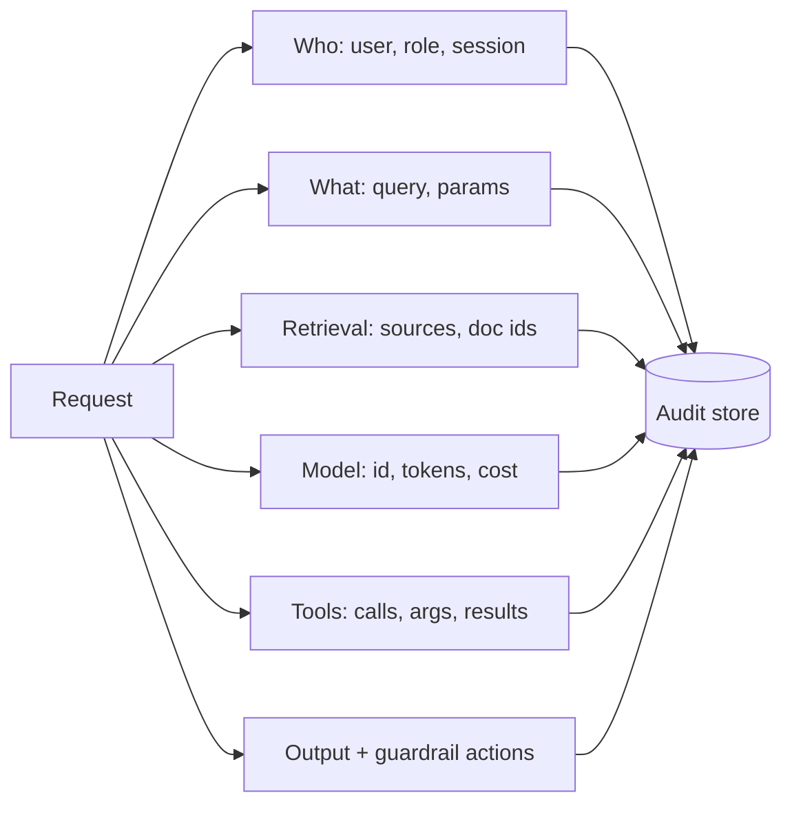

# Audit Logging

For accountability, debugging, and compliance, log **who did what, with which
data, and what the system produced** — across the whole GenAI pipeline.

## What to log

| Field | Why |
|-------|-----|
| User, role, session, timestamp | Accountability |
| Query + parameters | Reproduce and investigate |
| Retrieved doc IDs / sources | Prove grounding; data-access trail |
| Model id + version, tokens, cost | Cost + drift + upgrade tracking |
| Tool calls (args, results) | What actions the agent took |
| Guardrail decisions | What was blocked/redacted and why |
| Output (or hash) | What the user saw |

## Design considerations

- **Protect the logs** — prompts/responses may contain PII; encrypt, restrict
  access (RBAC), and apply retention. Consider logging hashes/redactions of
  sensitive fields.
- **Correlate with traces** — an audit record should link to the full
  observability trace (see [Monitoring](../monitoring/index.md)).
- **Immutability** — append-only / tamper-evident for compliance.
- **Retention** — align with policy (GDPR right-to-delete vs audit retention).

## Related

- [Monitoring & Observability](../monitoring/index.md)
  · [Compliance](../compliance/index.md)
  · [Observability & Eval](../../GenAI-Topics/observability/index.md)
