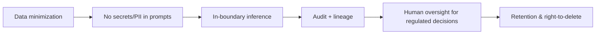

# Compliance

GenAI touches data privacy, security, and (in regulated industries) sector
rules. This maps common obligations to controls. *Not legal advice — align with
your compliance team.*

## Common frameworks → what they demand

| Framework | Core demands | GenAI controls |
|-----------|-------------|----------------|
| **GDPR / CCPA** | Lawful PII use, right to delete, data minimization | Don't put PII in prompts; redact; deletable stores; retention policy |
| **SOC 2 / ISO 27001** | Access control, logging, change mgmt | RBAC, audit logs, canary rollout, encryption |
| **HIPAA** (health) | PHI protection | In-boundary inference, BAA-covered services, strict access |
| **FERC / finance** | Data integrity, auditability | Lineage, immutable audit, human review of decisions |
| **EU AI Act** | Risk-tiered obligations, transparency | Document risk, human oversight, disclosure |

## Cross-cutting requirements

- **Know your data flow** — what leaves the boundary, where it's processed, how
  long it's kept. Prefer in-account/in-platform inference.
- **Human-in-the-loop** for consequential/regulated decisions.
- **Explainability & citations** — show sources so decisions are defensible.
- **Retention balance** — reconcile audit-retention with right-to-delete.
- **Vendor due diligence** — model provider data-use terms, region, certifications.

## Related

- [Security Architecture](../security-architecture/index.md)
  · [Audit Logging](../audit-logging/index.md)
  · [Security & Governance](../../Documentation/security-governance/index.md)
