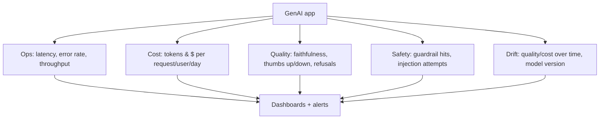

# Monitoring & Observability

Production GenAI needs the same operational visibility as any service — plus
quality signals unique to LLMs. See also
[Observability & Eval](../../GenAI-Topics/observability/index.md) for the
evaluation side.

## What to monitor

| Category | Metrics |
|----------|---------|
| **Operational** | Latency (TTFT + total), error rate, throughput, timeouts |
| **Cost** | Tokens & $ per request/user/tenant/day; cache hit rate |
| **Quality** | Faithfulness, answer relevance, user feedback, refusal rate |
| **Safety** | Guardrail triggers, injection attempts, PII redactions |
| **Drift** | Quality/cost trend, model version changes |

## Practices

- **Trace every request** end-to-end (retrieval → prompt → model → tools →
  output); tools: LangSmith, Langfuse, Arize/Phoenix, OpenTelemetry.
- **Alert on what matters** — cost spikes, error/latency SLOs, quality drops,
  guardrail surges.
- **Feedback loop** — capture thumbs up/down; route failures into the eval set.
- **Canary + compare** — when changing prompts/models, compare metrics on a
  slice before full rollout.

## Related

- [Observability & Eval](../../GenAI-Topics/observability/index.md)
  · [LLMOps](../../GenAI-Topics/llmops/index.md)
  · [Audit Logging](../audit-logging/index.md)
