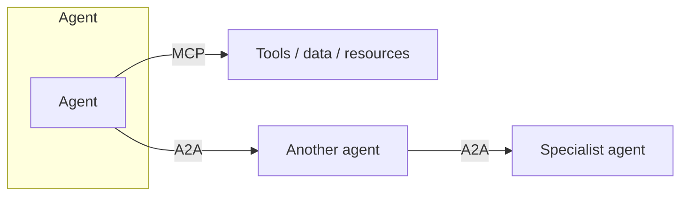

# A2A — Agent-to-Agent Communication

As systems move from a single agent to **teams of agents**, they need a way to
talk to each other: delegate tasks, share results, and coordinate. A2A is the
protocol/pattern layer for that — complementary to [MCP](../mcp/index.md) (which
connects an agent to *tools/data*).

<!-- RELATED-MODULE -->

## MCP vs A2A (don't confuse them)

| | MCP | A2A |
|-|-----|-----|
| Connects | Agent → tools/data | Agent → agent |
| Purpose | Give an agent capabilities | Let agents delegate & coordinate |
| Analogy | "USB-C for tools" | "Agents calling colleagues" |

## Multi-agent coordination patterns

| Pattern | Idea |
|---------|------|
| **Supervisor / orchestrator** | One agent plans and delegates to specialists |
| **Peer / hand-off** | Agents pass a task along a pipeline (research → write → review) |
| **Blackboard** | Agents read/write a shared state/store |
| **Marketplace / bidding** | Agents claim tasks they're suited for |

## What an A2A exchange needs

- **Identity & discovery** — who is this agent, what can it do (a capability
  card/manifest).
- **Task messages** — structured request + inputs + expected output.
- **Status & results** — progress, completion, errors, artifacts.
- **Trust & auth** — agents must authenticate; least privilege applies.

(Google's **A2A protocol** formalizes agent cards, tasks, and messaging;
frameworks like LangGraph/CrewAI/AutoGen implement multi-agent coordination.)

## When to go multi-agent

Default to **single-agent**. Introduce A2A/multi-agent when one agent's scope,
tools, or context become unreliable — e.g. distinct specialties (retrieval vs
coding vs review). Coordination adds latency, cost, and new failure modes, so
justify it.

## Interview deep dive

### Talking points
- **"MCP connects an agent to tools; A2A connects agents to each other."**
- **"Start single-agent; go multi-agent only when scope demands it."**
- **"A2A needs identity, discovery, structured tasks, and trust."**

### Scenario questions

??? question "When would you split one agent into multiple communicating agents?"
    When responsibilities/tools become too broad for reliable single-agent
    behavior — e.g. a planner delegating to a researcher, a coder, and a reviewer.
    Use a supervisor pattern; keep each agent's scope tight.

??? question "How is A2A different from just calling a function?"
    A2A treats the other party as an autonomous agent with its own reasoning and
    capability discovery, exchanging tasks/results — not a deterministic function
    call. It needs identity, negotiation, and trust between agents.

### Rapid-fire

| Q | A |
|---|---|
| MCP vs A2A? | Agent→tools vs agent→agent |
| Common pattern? | Supervisor delegating to specialists |
| A2A needs? | Identity, discovery, task messages, trust |
| Default? | Single-agent; multi-agent only when justified |
