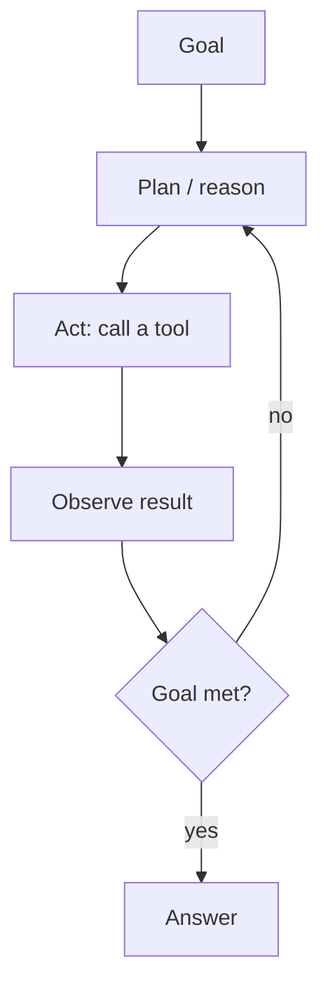
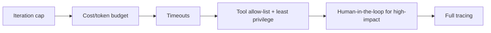

# Agent Engineering

Agent engineering is the discipline of building LLM systems that **reason, use
tools, and act** reliably — turning a chat model into a system that completes
multi-step goals. It's broader than any one framework (LangGraph, AgentCore):
patterns, tool design, control, and reliability.

<!-- RELATED-MODULE -->

## The core loop and its patterns

| Pattern | Idea | When |
|---------|------|------|
| **ReAct** | Interleave reasoning + tool actions | General tool-using agents |
| **Plan-and-execute** | Plan all steps up front, then run | Predictable multi-step tasks |
| **Reflection / self-critique** | Agent reviews and revises its own output | Quality-critical writing/code |
| **Router** | Classify the request, dispatch to a specialist | Mixed workloads |
| **Multi-agent** | Planner delegates to specialist agents | Scope too big for one agent |

## Tool design (the most underrated skill)

Agents are only as good as their tools. Design them like a good API:

- **Clear names + descriptions** — the model picks tools from these; be explicit.
- **Narrow, single-purpose** — `get_order_status(id)` beats `do_everything()`.
- **Typed, validated inputs** — reject bad args early; return structured results.
- **Idempotent + safe** — writes need confirmation/limits; reads are cheap.
- **Good error messages** — the model can recover if the error is informative.

## Reliability & control

- **Bound the loop** — max iterations and a cost budget stop runaways.
- **Least privilege** — separate read tools from write tools; gate writes.
- **Human-in-the-loop** — approval step before irreversible actions.
- **Deterministic fallback** — if the agent stalls, degrade to a fixed flow.
- **Evaluate on task success**, not token quality (see Observability).

## Single-agent vs multi-agent

Default to **single-agent** with a good tool set. Go multi-agent (a planner +
specialists, or a supervisor pattern) only when one agent's responsibilities and
context become unwieldy — coordination adds latency, cost, and new failure modes.

## Interview deep dive

### 60-second talking points

- **"An agent is a control loop around an LLM: plan, act, observe, repeat."**
- **"Tools are the API you give the model — design them narrow, typed, safe."**
- **"Reliability = bounds + least privilege + human-in-the-loop + tracing."**

### Scenario & system-design questions

??? question "Design a production agent that can take real actions (e.g. refunds)."
    ReAct loop with read tools (`get_order`, `get_policy`) and a guarded write tool
    (`issue_refund`). Least privilege; **human approval** above a threshold;
    validate args; cap iterations + cost; trace every step; evaluate on task
    success. Deterministic fallback if the agent fails.

??? question "Your agent loops forever / burns tokens. How do you fix it?"
    Add a **max-iteration cap** and cost budget; tighten tool descriptions so it
    picks correctly; ensure tools return clear success/failure so it knows when to
    stop; consider plan-and-execute or a chain if the path is actually fixed.

??? question "When do you choose multi-agent over single-agent?"
    When one agent's tool set/context is too broad to be reliable. Split into a
    planner + specialists. Otherwise the coordination overhead isn't justified.

??? question "How do you make an agent's tool use reliable?"
    Treat tools as APIs: narrow scope, typed/validated inputs, structured outputs,
    informative errors, idempotency, and least-privilege scopes. Test tools
    independently.

### Pitfalls interviewers probe

- No iteration/cost cap (runaway agents).
- Over-broad or vague tools → wrong tool selection.
- Over-privileged write tools with no confirmation.
- Multi-agent when single-agent would do.
- Evaluating tokens instead of task success.

### Rapid-fire

| Q | A |
|---|---|
| The agent loop? | Plan → act → observe → repeat until goal met |
| ReAct? | Interleave reasoning and tool actions |
| Reflection pattern? | Agent critiques and revises its own output |
| Contain a bad agent? | Caps, least privilege, human approval, tracing |
| Go multi-agent when? | One agent's scope/tools get too broad |
