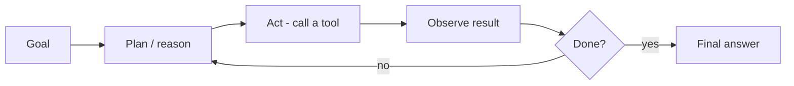

# AgentCore

Agentic AI is about LLMs that **plan, act, observe, and iterate** — using tools
and memory to complete multi-step goals rather than answering a single prompt.
Amazon Bedrock AgentCore provides runtime, memory, tools/gateway, identity, and
observability to run such agents in production.

<!-- RELATED-MODULE -->

## The agent loop

An agent reasons about what to do, calls a tool, observes the result, and repeats
until the goal is met (the ReAct pattern).

## Building blocks

| Component | Role |
|-----------|------|
| **Runtime** | Executes the agent loop reliably at scale |
| **Memory** | Short-term (conversation) + long-term (facts) |
| **Tools / Gateway** | Actions the agent can take (APIs, DBs) — often via MCP |
| **Identity** | Who the agent acts as; scoped permissions |
| **Guardrails** | Keep actions safe and in-policy |
| **Observability** | Trace steps, tool calls, cost, failures |

## Production concerns

- **Guardrails & least privilege** — constrain what tools can do.
- **Observability** — trace every step; you can't debug what you can't see.
- **Cost & loops** — cap iterations; agents can spin.
- **Evaluation** — task success rate, not just token quality.

## Single-agent vs multi-agent

Start single-agent. Move to multi-agent (a planner delegating to specialists)
only when one agent's tool set and context get unwieldy — coordination adds
complexity.

## Interview questions

??? question "What makes a system 'agentic'?"
    The LLM decides the steps: it plans, chooses and calls tools, observes results,
    and iterates toward a goal — versus a fixed prompt→answer flow.

??? question "How do you keep production agents safe and reliable?"
    Least-privilege tools, guardrails, iteration/cost caps, full tracing/
    observability, and task-level evaluation.

??? question "When do you go multi-agent?"
    When a single agent's responsibilities/tools become too broad; split into a
    planner + specialists. Otherwise the coordination overhead isn't worth it.

---

## Interview deep dive

### 60-second talking points

- **"Agentic = the model decides the steps."** Plan → act (tool) → observe →
  repeat, versus a fixed prompt→answer flow.
- **"Production agents live or die on guardrails, observability, and eval."**

### Scenario & system-design questions

??? question "Design a customer-support agent that can look up orders and issue refunds."
    Tools: `get_order`, `get_policy` (read), `issue_refund` (write, **guarded**).
    Runtime runs the plan→act→observe loop; **memory** for the conversation;
    **least-privilege** so refunds require checks/limits; **human approval** for
    refunds over a threshold; full **tracing** of every tool call; eval on task
    success rate.

??? question "Your agent occasionally takes wrong/expensive actions. How do you contain it?"
    Cap iterations and cost; scope tools tightly (read vs write); add confirmation/
    human-in-the-loop for high-impact actions; validate tool args; and trace
    everything so you can debug and evaluate. Guardrails on inputs/outputs.

??? question "Single-agent vs multi-agent — how do you decide?"
    Default single-agent. Split into a **planner + specialists** only when one
    agent's tools/context get unwieldy; multi-agent adds coordination overhead and
    failure modes, so justify it.

### Pitfalls interviewers probe

- No iteration/cost cap → runaway loops.
- Over-privileged write tools with no approval.
- No observability → can't debug agent behavior.
- Evaluating on token quality instead of **task success**.

### Rapid-fire

| Q | A |
|---|---|
| What makes it agentic? | Model plans, calls tools, observes, iterates |
| The loop? | Plan → act → observe → repeat until done |
| Contain a bad agent? | Least-privilege tools, caps, human approval, tracing |
| Multi-agent when? | One agent's scope/tools become too broad |
