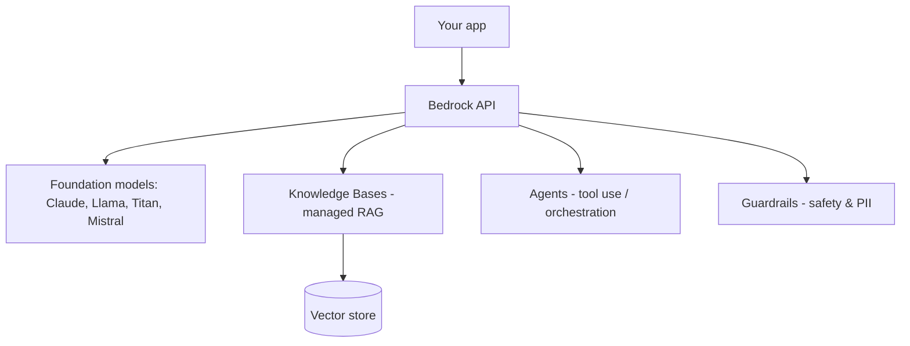

# Amazon Bedrock

Bedrock is AWS's managed service for foundation models — call multiple providers
(Anthropic Claude, Meta Llama, Amazon Titan, Mistral, etc.) through one API, with
enterprise security, and add RAG, agents, and guardrails.

<!-- RELATED-MODULE -->

## What Bedrock provides



| Feature | Purpose |
|---------|---------|
| **Model access** | One API across providers; no infra to manage |
| **Knowledge Bases** | Managed RAG: ingest → embed → retrieve |
| **Agents** | Multi-step tool use / orchestration |
| **Guardrails** | Content filtering, PII redaction, denied topics |
| **Provisioned throughput** | Reserved capacity for production |

```python
import boto3, json
rt = boto3.client("bedrock-runtime")
resp = rt.invoke_model(
    modelId="anthropic.claude-3-5-sonnet-20240620-v1:0",
    body=json.dumps({
        "anthropic_version": "bedrock-2023-05-31",
        "max_tokens": 300,
        "messages": [{"role": "user", "content": "Summarize RAG in 2 lines."}],
    }),
)
```

## Why enterprises pick Bedrock

Data stays in your AWS account, integrates with IAM/VPC/CloudWatch, no model
hosting to manage, and you can swap models without rewriting the app.

## Interview questions

??? question "What does Bedrock give you over calling an LLM API directly?"
    Managed multi-provider access under AWS security (IAM, VPC, logging), plus
    built-in Knowledge Bases (RAG), Agents, and Guardrails — no infrastructure.

??? question "How do Bedrock Knowledge Bases implement RAG?"
    They ingest your documents, chunk and embed them into a vector store, and
    retrieve relevant chunks at query time to ground the model — managed for you.

??? question "What are Guardrails for?"
    Policy enforcement: block denied topics, filter harmful content, and redact
    PII consistently across models.

---

## Interview deep dive

### 60-second talking points

- **"One API, many models, inside your AWS boundary."** Swap Claude/Llama/Titan
  without rewriting; data stays in your account under IAM/VPC.
- **"Knowledge Bases = managed RAG; Agents = managed tool use; Guardrails =
  policy."** You assemble, AWS operates.

### Scenario & system-design questions

??? question "Design an enterprise RAG assistant on AWS with governance."
    **Bedrock Knowledge Base** (ingest → embed → vector store) for retrieval →
    **Bedrock model** for generation → **Guardrails** for PII/denied topics →
    front with API Gateway + Lambda; IAM roles, VPC endpoints, CloudWatch. No data
    leaves the account.

??? question "How do you choose/switch models cost-effectively?"
    Start with a smaller/cheaper model, measure quality on an eval set, upgrade
    only where needed; use **provisioned throughput** for steady high volume,
    on-demand for spiky; the single API makes swapping low-effort.

??? question "What do Guardrails actually enforce?"
    Denied topics, harmful-content filters, and **PII redaction** applied
    consistently across models — a policy layer independent of the chosen model.

### Pitfalls interviewers probe

- Thinking Bedrock hosts *your* fine-tuned model for free (it's managed FMs; custom
  work has its own path/cost).
- Skipping Guardrails on user-facing apps.
- Ignoring per-model token pricing differences.

### Rapid-fire

| Q | A |
|---|---|
| Bedrock value vs raw API? | Managed multi-model under AWS security + KB/Agents/Guardrails |
| Knowledge Bases? | Managed RAG (ingest/embed/retrieve) |
| Guardrails? | Content filtering + PII redaction + denied topics |
| Steady high volume? | Provisioned throughput |
