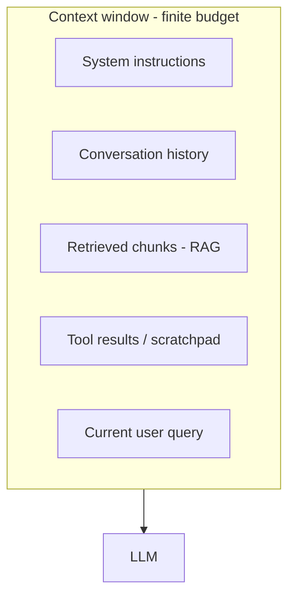

# Context Engineering

Context engineering is the discipline of deciding **what goes into the model's
context window, and how** — the tokens the model actually sees on each call. It's
the layer above prompt engineering: prompts are wording; context engineering is
*assembly and budget management* across a whole conversation or agent run.

<!-- RELATED-MODULE -->

## Why it matters

The context window is finite and every token costs money and latency. Two failure
modes:

- **Too little** — the model lacks the facts it needs → hallucination.
- **Too much / wrong** — irrelevant tokens dilute attention ("lost in the
  middle"), raise cost, and can even lower accuracy.

## What you're assembling

| Piece | Concern |
|-------|---------|
| **System prompt** | Stable instructions, role, guardrails |
| **Conversation history** | Grows unbounded — must be managed |
| **Retrieved context (RAG)** | Only the top-k relevant chunks, with budget |
| **Tool outputs / scratchpad** | Agent intermediate results, often verbose |
| **Current query** | The actual request |

## Managing history (memory strategies)

| Strategy | How | Trade-off |
|----------|-----|-----------|
| **Full history** | Keep everything | Simple; blows the budget fast |
| **Sliding window** | Keep last N turns | Cheap; loses old context |
| **Summarization / compaction** | Summarize old turns into a running summary | Preserves gist; summary can drift |
| **Retrieval memory** | Store turns in a vector DB, retrieve relevant ones | Scales; adds retrieval complexity |
| **Structured memory** | Extract facts to a store (user prefs, entities) | Precise; needs schema |

## Techniques that matter

- **Retrieval budgeting** — cap how many chunks/tokens RAG injects; re-rank so the
  best are first (mitigates "lost in the middle").
- **Compaction** — when history nears the limit, summarize older turns and drop
  raw text; keep recent turns verbatim.
- **Ordering** — put the most important context near the top and bottom (models
  attend to the edges more than the middle).
- **Isolation** — separate untrusted retrieved/tool content from instructions
  (also a prompt-injection defense).
- **Token accounting** — measure tokens per component; know your budget.

## Interview deep dive

### 60-second talking points

- **"Prompt engineering is the wording; context engineering is what's in the
  window and how it's budgeted."**
- **"More context isn't better — relevance and ordering beat volume."**
- **"Long conversations need compaction or retrieval memory, not raw history."**

### Scenario & system-design questions

??? question "A long chat agent starts giving worse answers over time. Why?"
    History grew until it crowded out room for retrieval/instructions, or key
    facts got pushed into the "lost in the middle" zone. Fix with **compaction**
    (summarize old turns), a **sliding window** for recency, and **retrieval
    memory** for older facts; re-rank so the most relevant context is at the edges.

??? question "How do you decide what to put in the context window for a RAG call?"
    System prompt + a **budgeted** set of top-k re-ranked chunks + the query, with
    token accounting so you don't exceed the window. Drop or summarize anything
    low-value; keep citations.

??? question "How does context engineering relate to prompt injection?"
    Retrieved and tool content is untrusted — keep it clearly separated from system
    instructions and never let it be interpreted as commands. Context assembly is
    where you enforce that boundary.

### Pitfalls interviewers probe

- Dumping full history/all chunks into every call (cost, dilution).
- Ignoring "lost in the middle" (bad ordering).
- No token budget/accounting.
- Treating retrieved content as trusted instructions.
- Summaries that silently lose critical facts.

### Rapid-fire

| Q | A |
|---|---|
| Context vs prompt engineering? | What's in the window & budget vs the wording |
| "Lost in the middle"? | Models attend less to middle context → order matters |
| History strategies? | Full, sliding window, summarization, retrieval memory |
| Compaction? | Summarize old turns when nearing the token limit |
| Why not max context always? | Cost, latency, and diluted attention |
