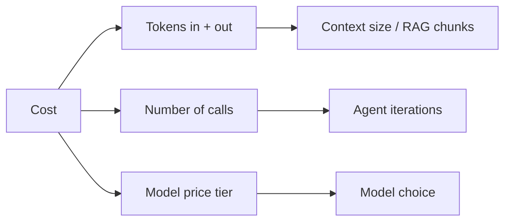
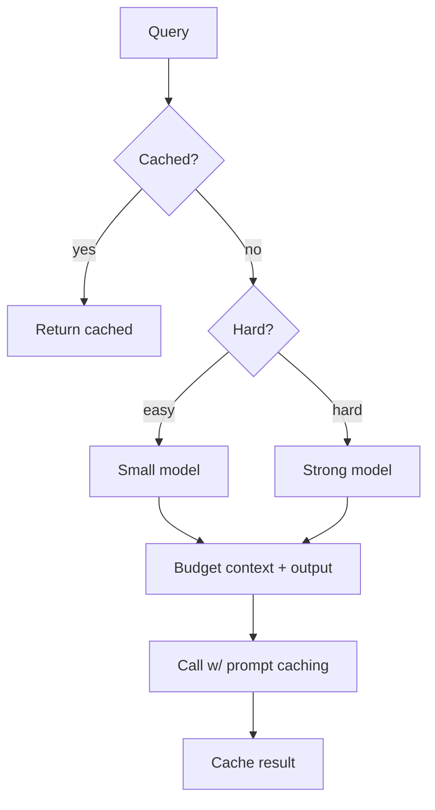

# Cost Optimization

LLM bills scale with **tokens × calls × model price**. This page is the practical
playbook for cutting cost without wrecking quality. See also
[LLMOps](../llmops/index.md).

<!-- RELATED-MODULE -->

## Where the money goes

## The levers (biggest first)

| Lever | How | Typical savings |
|-------|-----|-----------------|
| **Model routing** | Cheap model for easy queries, strong for hard | Large |
| **Prompt caching** | Reuse a fixed prefix (system + docs) across calls | Large for repeated prefixes |
| **Right-sizing** | Smallest model that passes eval | Large |
| **Token budgeting** | Cap input (trim context/RAG) and output (max_tokens) | Medium |
| **Response caching** | Cache identical/similar queries | Medium (repetitive traffic) |
| **Fewer agent steps** | Iteration caps, better tools/plans | Medium |
| **Batching** | Group requests (self-host) | Medium (throughput) |
| **Shorter prompts** | Trim verbose system prompts / few-shot | Small–medium |

## A cost-aware request

## Guardrails so cuts don't hurt quality

- **Measure on an eval set** — every cost change is scored for quality
  regression, not guessed.
- **Watch the metric that matters** — cost *per successful task*, not per call.
- **Monitor** cost per user/tenant/day; alert on spikes.

## Common wins

- Move classification/routing/extraction to a **small model**.
- Turn on **prompt caching** when the system prompt or retrieved docs repeat.
- **Trim RAG** — retrieve wide, rerank, keep only the top few chunks.
- **Cap agent iterations** — most runaway cost is agent loops.

## Interview deep dive

### Talking points
- **"Cost = tokens × calls × price — attack all three."**
- **"Biggest levers: routing, caching, right-sizing."**
- **"Measure cost per successful task, gated by an eval set."**

### Scenario questions

??? question "Your GenAI feature's monthly bill doubled. Walk through cutting it."
    Break down by tokens/calls/model. Route easy queries to a cheaper model; enable
    **prompt caching** for the fixed prefix; **trim context** (fewer, reranked
    chunks; max_tokens); cache repeated queries; cap agent iterations. Re-run the
    eval set so quality holds.

??? question "How do you decide if a cheaper model is 'good enough'?"
    Evaluate it on a labeled set for the actual task; if it passes the quality bar
    (faithfulness/accuracy), route eligible traffic to it and keep the strong model
    for the hard slice.

### Rapid-fire

| Q | A |
|---|---|
| Cost drivers? | Tokens (in+out), call count, model price |
| Biggest lever? | Model routing + right-sizing |
| Prompt caching? | Reuse a fixed prefix to cut cost/latency |
| Right metric? | Cost per successful task |
| Runaway agent cost fix? | Iteration + cost caps |
