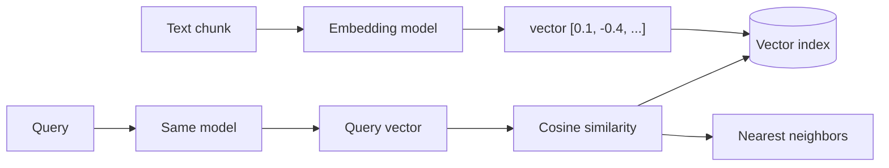

# Embedding Models

Embeddings turn text into vectors that capture meaning — the foundation of
semantic search, RAG, clustering, and classification. Choosing and using the
right embedding model matters as much as the LLM.

<!-- RELATED-MODULE -->

## How embeddings power retrieval

## What to compare

| Factor | Why it matters |
|--------|----------------|
| **Dimensions** | Higher = more expressive but more storage/compute (e.g. 384 → 3072) |
| **Max input length** | Must cover your chunk size |
| **Domain/language fit** | Match to your content (code, legal, multilingual) |
| **Quality (MTEB)** | Benchmark score for retrieval tasks |
| **Cost & hosting** | API per-token vs self-hosted open model |
| **Normalization** | Cosine assumes normalized vectors |

## Common options (by category)

| Model family | Notes |
|--------------|-------|
| **OpenAI `text-embedding-3` (small/large)** | Strong, easy API; large = 3072-dim |
| **Cohere Embed v3** | Strong retrieval, multilingual, rerank pairing |
| **Amazon Titan Embeddings** | In-AWS/Bedrock, keeps data in-boundary |
| **Voyage AI** | High MTEB, domain variants (code, finance) |
| **Open: `bge`, `e5`, `gte`, `nomic`** | Self-host, no per-call cost, good quality |
| **Sentence-Transformers (MiniLM etc.)** | Lightweight, local, fast |

## Rules that trip people up

- **Same model for index and query** — vectors from different models aren't
  comparable. Changing models means **re-embedding the whole corpus**.
- **Match the metric** — cosine for normalized text embeddings (most common).
- **Dimensions ≠ always better** — bigger costs more storage/latency; measure.
- **Embedding model ≠ the LLM** — it's a separate (often smaller) model.
- **Chunk quality drives it** — the vector represents a chunk; keep chunks
  self-contained.

## Interview deep dive

### Talking points
- **"Embeddings map meaning to vectors; similar meaning → nearby vectors."**
- **"Use the same model to index and query, or the vectors don't compare."**
- **"Pick by domain fit + MTEB + cost, not just dimensions."**

### Scenario questions

??? question "You upgraded the embedding model and search got worse. Why?"
    Old and new vectors are incompatible. You must **re-embed the entire corpus**
    with the new model and query with the same one; mixing them yields meaningless
    neighbors.

??? question "How do you pick an embedding model for a legal-document RAG?"
    Favor domain/length fit (long legal passages → larger max input), strong MTEB
    retrieval score, and governance (in-boundary like Titan if data-sensitive).
    Validate on your own labeled retrieval set, not just the benchmark.

### Rapid-fire

| Q | A |
|---|---|
| What's an embedding? | A vector capturing text meaning |
| Index vs query model? | Must be the **same** model |
| Change model → | Re-embed everything |
| Metric for text? | Cosine (normalized) |
| Benchmark? | MTEB |
