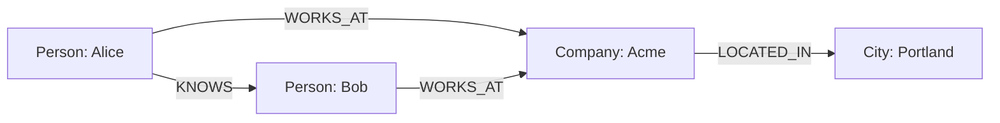

# Graph DB & GraphRAG

Graph databases store data as **nodes** and **relationships**, making connected
queries (paths, neighbors, patterns) natural and fast. In GenAI they power
**knowledge graphs** and **GraphRAG** — retrieval that follows relationships, not
just vector similarity.

<!-- RELATED-MODULE -->

## Nodes and relationships



Everything is a node (with labels/properties) or a relationship (typed,
directional, with properties). Traversing relationships is a first-class,
index-free operation.

## Query languages

=== "Cypher (Neo4j)"

    ```cypher
    MATCH (a:Person)-[:KNOWS]->(b:Person)-[:WORKS_AT]->(c:Company)
    WHERE a.name = 'Alice'
    RETURN b.name, c.name
    ```

=== "Gremlin"

    ```groovy
    g.V().has('Person','name','Alice')
     .out('KNOWS').out('WORKS_AT').values('name')
    ```

## GraphRAG

Instead of only fetching similar text chunks, GraphRAG retrieves an entity's
**connected context** by walking the knowledge graph — great for multi-hop
questions ("which suppliers are affected if factory X goes down?") where the
answer depends on relationships, not just semantic similarity.

## When to use a graph DB

- Highly connected data (social, org charts, supply chains, fraud rings).
- Multi-hop / path queries that are painful as SQL joins.
- Knowledge graphs backing GenAI retrieval.

## Interview questions

??? question "Graph DB vs relational for connected data?"
    Graphs treat relationships as first-class and traverse them in constant time
    per hop, avoiding expensive multi-join queries; relational is better for
    tabular, set-based analytics.

??? question "What is GraphRAG and when does it beat vector RAG?"
    Retrieval that walks a knowledge graph for connected context. It wins on
    multi-hop, relationship-dependent questions where pure vector similarity misses
    the chain of facts.

??? question "Cypher vs Gremlin?"
    Cypher (Neo4j) is a declarative, pattern-matching language; Gremlin is an
    imperative graph-traversal language. Both express node/relationship queries.

---

## Interview deep dive

### 60-second talking points

- **"Relationships are first-class."** Traversing connections is a constant-time
  hop, not an expensive join — ideal for connected data.
- **"GraphRAG follows the graph, not just similarity."** Great for multi-hop,
  relationship-dependent questions.

### Scenario & system-design questions

??? question "When would you pick a graph DB over relational for a feature?"
    Highly connected data with **multi-hop** queries — fraud rings, supply chains,
    org/social networks, recommendations. If most queries are "who/what is
    connected to X within N hops," a graph avoids painful recursive joins.

??? question "How does GraphRAG beat vector RAG on some questions?"
    For questions whose answer depends on a **chain of relationships** ("which
    customers are affected if supplier X fails?"), walking a knowledge graph
    retrieves connected context that pure vector similarity would miss. Often
    combined: vectors to find entry nodes, graph to expand context.

??? question "How do you build a knowledge graph for GenAI?"
    Extract **entities + relationships** from documents (LLM or NLP), load as
    nodes/edges with properties, then query with Cypher/Gremlin — or feed the
    subgraph as grounded context to the LLM (GraphRAG).

### Pitfalls interviewers probe

- Using a graph DB for tabular/aggregate analytics (relational/warehouse wins).
- Modeling mistakes: storing everything as properties instead of relationships.
- Assuming GraphRAG replaces vector RAG (often complementary).

### Rapid-fire

| Q | A |
|---|---|
| Graph vs relational? | First-class relationships, cheap multi-hop traversal |
| Query languages? | Cypher (Neo4j, declarative), Gremlin (traversal) |
| GraphRAG? | Retrieve connected context by walking a knowledge graph |
| Best fit data? | Connected: fraud, supply chain, social, recommendations |
