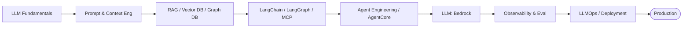

# GenAI Topics

The building blocks of Generative & Agentic AI, from fundamentals through
production. Each topic has its own page with diagrams and an interview deep dive.

## Foundations

-   :material-school: __LLM Fundamentals__

    Tokens, sampling, embeddings, context windows, fine-tune vs RAG.

    [Open](llm-fundamentals/index.md)

-   :material-text-box-edit: __Prompt Engineering__

    Few-shot, chain-of-thought, structured output, injection defense.

    [Open](prompt-engineering/index.md)

-   :material-window-restore: __Context Engineering__

    Context windows, memory, compaction, retrieval budgeting.

    [Open](context-engineering/index.md)

## Retrieval & knowledge

-   :material-database-search: __RAG__

    [Open](rag/index.md)

-   :material-vector-triangle: __Vector DB__

    [Open](vector-db/index.md)

-   :material-graph-outline: __Graph DB__

    [Open](graph-db/index.md)

## Orchestration & agents

-   :material-link-variant: __LangChain__

    [Open](langchain/index.md)

-   :material-graph: __LangGraph__

    [Open](langgraph/index.md)

-   :material-connection: __MCP__

    [Open](mcp/index.md)

-   :material-robot-industrial: __Agent Engineering__

    [Open](agent-engineering/index.md)

-   :material-account-cog: __AgentCore__

    [Open](agentcore/index.md)

-   :material-aws: __Bedrock__

    [Open](bedrock/index.md)

## Production

-   :material-chart-line: __Observability & Eval__

    Tracing, LLM-as-judge, metrics, guardrails, monitoring.

    [Open](observability/index.md)

-   :material-cog-sync: __LLMOps / Deployment__

    Serving, scaling, caching, cost, lifecycle.

    [Open](llmops/index.md)

