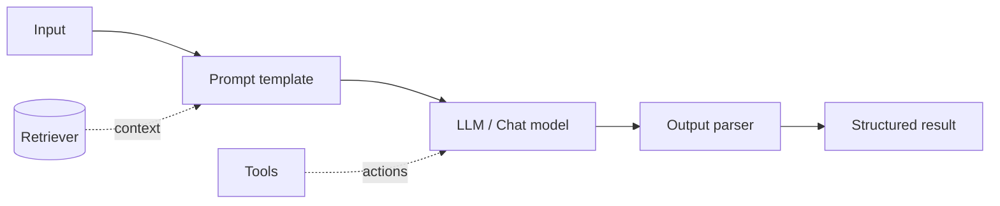

# LangChain

LangChain is a framework for composing LLM applications from reusable pieces:
prompts, models, retrievers, tools, and memory — wired together with **LCEL**
(LangChain Expression Language).

<!-- RELATED-MODULE -->

## Building blocks



- **Prompt templates** — parameterized prompts.
- **Models** — chat/LLM wrappers with a common interface.
- **Output parsers** — coerce text into structured data (JSON, Pydantic).
- **Retrievers** — pluggable RAG sources.
- **Tools & agents** — let the model take actions.
- **Memory** — carry conversation state.

## LCEL — composition with pipes

```python
from langchain_core.prompts import ChatPromptTemplate
from langchain_core.output_parsers import StrOutputParser

prompt = ChatPromptTemplate.from_template("Explain {topic} in one sentence.")
chain = prompt | model | StrOutputParser()
chain.invoke({"topic": "vector databases"})
```

The `|` operator composes runnables into a pipeline that supports streaming,
batching, and async out of the box.

## Chains vs agents

- **Chain** — a fixed sequence you define (predictable, cheaper).
- **Agent** — the LLM decides which tools to call and in what order (flexible,
  more tokens, needs guardrails). Use a chain when the steps are known.

## Interview questions

??? question "Chain vs agent — when to use which?"
    Use a chain when the workflow is known and deterministic. Use an agent when the
    path depends on intermediate results and the model must choose tools — at the
    cost of latency, tokens, and reliability.

??? question "What is LCEL and why does it help?"
    A declarative way to compose runnables with `|`. You get streaming, batching,
    async, and retries uniformly, and components swap cleanly.

??? question "How does LangChain support RAG?"
    Retrievers plug into chains to fetch context, which is formatted into the
    prompt before the model call — with vector stores, re-rankers, and parsers as
    swappable parts.

---

## Interview deep dive

### 60-second talking points

- **"LangChain composes LLM apps from swappable parts."** Prompts, models,
  retrievers, tools, memory — wired with LCEL pipes.
- **"Chain when the path is known; agent when the model must decide."**
- **"LCEL gives streaming/batch/async for free."**

### Scenario & system-design questions

??? question "Build a RAG chatbot with conversation memory in LangChain."
    Retriever (vector store) → format context into a prompt template → chat model
    → output parser, composed via LCEL. Add **memory** to carry history, and a
    **history-aware retriever** that rewrites follow-up questions ("what about
    it?") into standalone queries before retrieving.

??? question "Your agent loops and burns tokens. How do you make it production-safe?"
    Cap **max iterations**; give a tight, well-described tool set; add timeouts and
    cost budgets; prefer a **chain** if the flow is actually deterministic; log
    every step for observability; and validate tool inputs/outputs.

??? question "Why might you NOT use LangChain?"
    For simple single-call apps the abstraction adds overhead/indirection; some
    teams prefer thin direct SDK calls or lighter frameworks. Use it when you
    genuinely benefit from swappable components, agents, and RAG plumbing.

### Pitfalls interviewers probe

- Using an agent where a chain suffices (latency, cost, flakiness).
- No max-iteration/tool guardrails.
- Over-abstracting simple flows.
- Ignoring history rewriting in multi-turn RAG.

### Rapid-fire

| Q | A |
|---|---|
| LCEL? | Declarative composition with `|`; streaming/batch/async built in |
| Chain vs agent? | Fixed sequence vs model chooses tools/steps |
| Memory? | Carries conversation state across turns |
| History-aware retriever? | Rewrites follow-ups into standalone queries |
