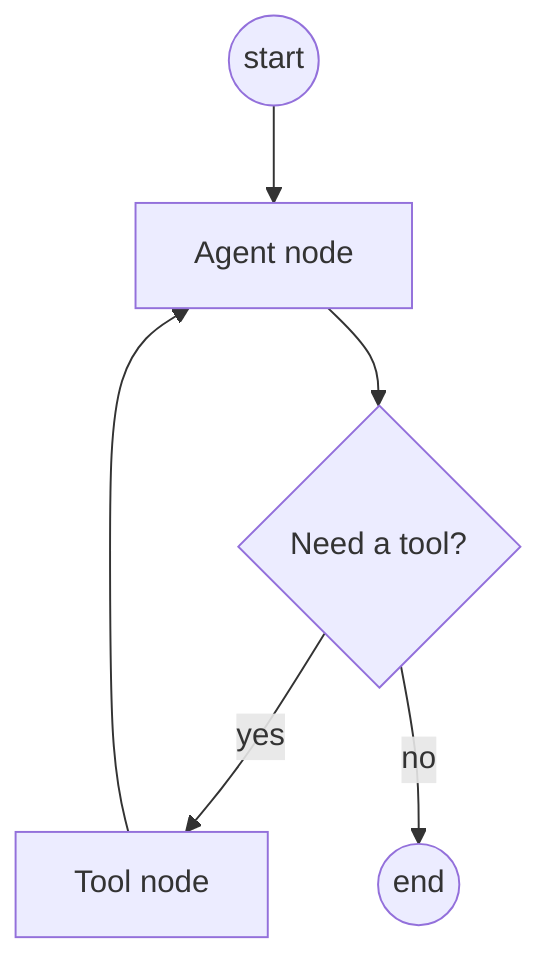

# LangGraph

LangGraph models agent workflows as a **graph** of nodes (steps) and edges
(transitions) with shared **state** — giving you cycles, branching, and
human-in-the-loop that plain linear chains can't express.

<!-- RELATED-MODULE -->

## Graph model

- **Nodes** — functions/LLM calls that read and update state.
- **Edges** — control flow; **conditional edges** branch on state.
- **State** — a typed object passed through the graph (e.g. messages, scratchpad).
- **Cycles** — nodes can loop back (agent ↔ tools) — the key difference from a
  chain.

## Why a graph over a chain

- **Loops**: agent calls a tool, sees the result, decides again.
- **Branching**: route based on classification or validation.
- **Human-in-the-loop**: pause for approval, then resume.
- **Persistence**: checkpoint state to resume long-running or interrupted runs.

## Interview questions

??? question "LangGraph vs a LangChain chain?"
    A chain is a linear/DAG pipeline; LangGraph adds explicit state plus cycles and
    conditional edges, so you can model iterative agents and branching workflows.

??? question "Why is shared state important?"
    Nodes communicate through a typed state object, enabling loops, checkpointing/
    resume, and human-in-the-loop without threading data manually between steps.

??? question "Give a use case that needs LangGraph, not a chain."
    An agent that repeatedly calls tools until a condition is met, or a workflow
    that pauses for human approval then continues — both require cycles/branching.

---

## Interview deep dive

### 60-second talking points

- **"Graph, not pipeline."** Nodes + edges + shared state let you express
  **loops**, **branching**, and **human-in-the-loop** — things a linear chain
  can't.
- **"State is the contract."** A typed state object flows through nodes, enabling
  checkpointing and resume.

### Scenario & system-design questions

??? question "Design an agent that researches, then writes, then self-reviews before answering."
    Nodes: `plan → retrieve → draft → critique → (loop back to draft if critique
    fails) → finalize`. Conditional edge on the critique result creates the
    **revision loop**; shared state holds the draft + feedback; checkpoint so a
    long run can resume.

??? question "You need a human to approve an action before the agent proceeds. How?"
    Use **human-in-the-loop**: the graph **interrupts** at an approval node,
    persists state via a checkpointer, and **resumes** after the human decision —
    impossible cleanly in a stateless chain.

??? question "When is LangGraph overkill?"
    For a straight prompt→retrieve→answer flow with no loops/branches, a plain
    LCEL chain is simpler. Reach for LangGraph when you need cycles, conditional
    routing, persistence, or multi-agent coordination.

### Pitfalls interviewers probe

- No termination condition on a cyclic graph → infinite loop.
- Bloated state object (pass only what nodes need).
- Using it for flows that don't need cycles/branching.

### Rapid-fire

| Q | A |
|---|---|
| Core primitives? | Nodes, edges, shared state |
| vs a chain? | Adds cycles, conditional edges, persistence |
| Human-in-the-loop? | Interrupt → persist → resume |
| Why shared state? | Enables loops, checkpointing, resume |
