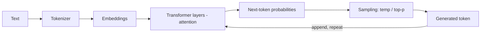
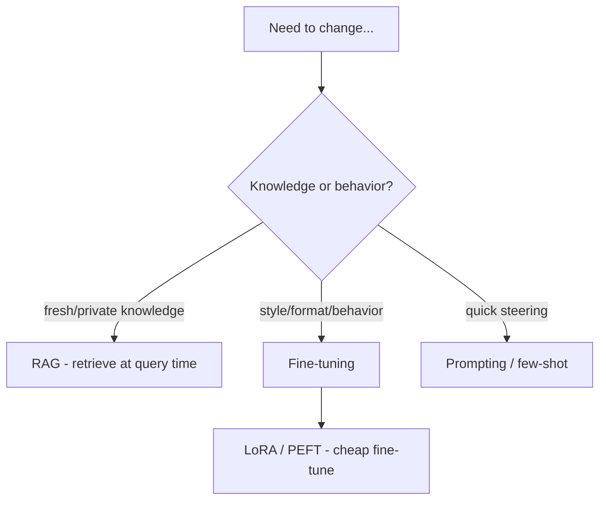

# LLM Fundamentals

The concepts every GenAI engineer should be fluent in: how models represent
text, generate it, and how you adapt them. This underpins every other topic.

<!-- RELATED-MODULE -->

## From text to tokens to output

- **Tokens** — models read/write **tokens** (~¾ of a word each), not characters.
  Cost and context limits are measured in tokens.
- **Embeddings** — tokens/text map to vectors capturing meaning (basis of RAG &
  vector search).
- **Transformer + attention** — each token attends to others; **self-attention**
  is the core mechanism.
- **Autoregressive generation** — the model predicts the next token, appends it,
  and repeats.

## Sampling controls

| Parameter | Effect |
|-----------|--------|
| **Temperature** | Higher = more random/creative; lower = more deterministic |
| **Top-p (nucleus)** | Sample from the smallest set of tokens summing to p |
| **Top-k** | Sample from the k most likely tokens |
| **Max tokens** | Caps output length |
| **Stop sequences** | End generation at a marker |

For factual/structured tasks → low temperature. For brainstorming → higher.

## Context window

The max tokens (input + output) a model can consider at once. Larger windows fit
more context but cost more and can dilute attention ("lost in the middle") — see
[Context Engineering](../context-engineering/index.md).

## Ways to adapt a model

| Approach | Changes | Cost | Use when |
|----------|---------|------|----------|
| **Prompting / few-shot** | Behavior at call time | Cheapest | Quick steering, format |
| **RAG** | Adds knowledge | Low | Fresh/private/changing facts + citations |
| **Fine-tuning** | Bakes in behavior/style | High | Consistent style/format, narrow domain |
| **LoRA / PEFT** | Efficient fine-tune | Medium | Fine-tune without full retrain |

**Rule of thumb:** need *knowledge* → RAG; need *behavior/style* → fine-tune;
need *quick change* → prompt. Most enterprise apps start with RAG.

## Other essentials

- **Hallucination** — plausible but wrong output; mitigate with grounding
  (RAG), "say you don't know," low temp, and verification.
- **Context vs parametric knowledge** — what's in the prompt vs what's baked in
  the weights (and possibly stale).
- **Embeddings ≠ the LLM** — a separate (often smaller) model produces vectors
  for retrieval.
- **Cost/latency** scale with tokens (input + output) and model size.

## Interview deep dive

### 60-second talking points

- **"Models work in tokens; cost, context, and limits are all token-based."**
- **"Temperature/top-p trade determinism for creativity."**
- **"Knowledge → RAG; behavior → fine-tune; quick change → prompt."**

### Scenario & system-design questions

??? question "A stakeholder asks: should we fine-tune or use RAG?"
    Ask what needs to change. **Fresh/private/changing knowledge** or a need for
    citations → **RAG** (cheaper, current, no retraining). Consistent **style,
    format, or domain behavior** → **fine-tuning** (or LoRA). Often RAG first;
    fine-tune only if behavior still isn't right.

??? question "Outputs are too random / too repetitive. What do you tune?"
    Lower **temperature** (and/or top-p) for more deterministic, factual output;
    raise it for creativity. Add stop sequences and max-tokens for control. For
    structure, use structured output rather than just temperature.

??? question "Why do larger context windows not always help?"
    More tokens cost more and add latency, and models attend less to the middle of
    long contexts ("lost in the middle") — so relevance and ordering matter more
    than raw size.

### Pitfalls interviewers probe

- Confusing tokens with words/characters.
- Fine-tuning to add knowledge (that's RAG's job).
- High temperature for factual tasks.
- Assuming bigger context = better answers.
- Thinking the embedding model is the same as the chat LLM.

### Rapid-fire

| Q | A |
|---|---|
| What's a token? | ~¾ word unit models read/write; basis of cost/limits |
| Temperature? | Randomness of sampling (low=deterministic) |
| Context window? | Max tokens (in+out) considered at once |
| RAG vs fine-tune? | Knowledge vs behavior/style |
| LoRA/PEFT? | Efficient fine-tuning without full retrain |
| Hallucination fix? | Ground (RAG), "say you don't know", low temp, verify |
