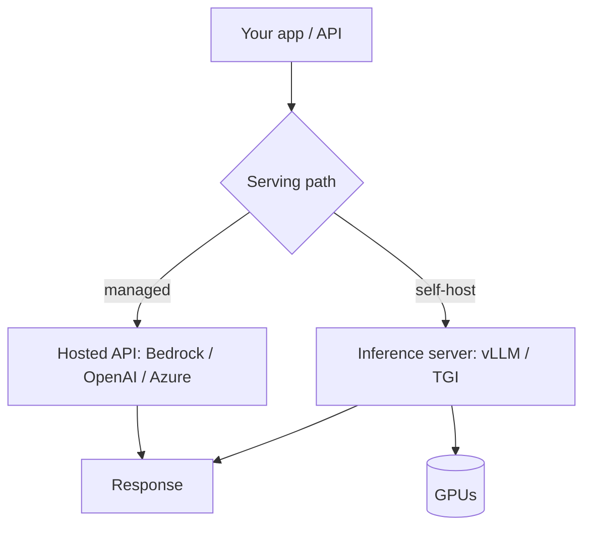

# LLMOps / Deployment

LLMOps is MLOps for LLM apps: **serving, scaling, cost control, caching,
versioning, and lifecycle** of models and prompts in production. It's what turns
a working prototype into a reliable, affordable service.

<!-- RELATED-MODULE -->

## Serving options

| Path | Pros | Cons |
|------|------|------|
| **Managed API** (Bedrock, OpenAI, Azure) | No infra, fast to ship, scales | Per-token cost, less control, data-egress concerns |
| **Self-hosted** (vLLM, TGI, Ollama) | Control, data stays in, fixed cost | You manage GPUs, scaling, ops |

## Performance & cost levers

- **Caching** — cache identical prompts/responses; **prompt caching** reuses a
  fixed prefix (system prompt, docs) across calls to cut cost/latency.
- **KV cache** — self-hosted servers reuse attention state across tokens
  (vLLM's paged KV cache boosts throughput).
- **Batching** — group concurrent requests for GPU efficiency.
- **Quantization** — 8-bit/4-bit weights shrink memory and speed inference with
  small quality loss.
- **Model right-sizing** — use the smallest model that passes eval; route easy
  queries to cheap models, hard ones to strong models (**model routing**).
- **Streaming** — stream tokens for perceived latency.
- **Token budgets** — cap input/output; trim context (see Context Engineering).

## Lifecycle & governance

- **Prompt versioning** — treat prompts as code: version, review, test, roll back.
- **Model versioning** — pin model versions; test before upgrading (models drift).
- **CI/CD with evals** — run the eval suite on every prompt/model change (see
  Observability).
- **Canary / A-B rollout** — ship changes to a slice first.
- **Guardrails + monitoring** — in the request path and on metrics (cost,
  latency, error rate, quality).
- **Secrets & data** — keys in a secrets manager; know where data flows
  (governance, PII, region).

## Reliability patterns

- **Timeouts + retries** on model calls; **fallback** to a smaller model or cached
  answer on failure.
- **Rate limiting** per user/tenant.
- **Graceful degradation** — return a useful partial/extractive answer if the LLM
  is down (like this site's own agent).

## Interview deep dive

### 60-second talking points

- **"Managed API to ship fast; self-host (vLLM/TGI) for control and fixed cost."**
- **"Biggest cost levers: caching, right-sizing/routing, and token budgets."**
- **"Treat prompts and model versions as code, gated by an eval suite."**

### Scenario & system-design questions

??? question "Your LLM feature's bill is too high. How do you cut cost without wrecking quality?"
    Route easy queries to a **cheaper model**, reserve the strong model for hard
    ones (**model routing**); enable **prompt caching** for the fixed prefix;
    trim context with budgets; cache repeated queries; and cap max tokens.
    Measure quality on the eval set so cuts don't regress accuracy.

??? question "Design deployment for a customer-facing RAG chatbot."
    App/API (FastAPI) → retrieval → **managed model (Bedrock)** or self-hosted
    vLLM → guardrails → streaming response. Add caching, timeouts+retries with a
    fallback model, rate limiting, tracing/monitoring, prompt/model versioning,
    and CI evals. Canary new versions.

??? question "When would you self-host a model instead of using a managed API?"
    Data must stay in-house (compliance), you need a custom/fine-tuned model, want
    fixed cost at high steady volume, or need latency/control a hosted API can't
    give. Trade-off: you own GPU ops and scaling.

??? question "How do you safely upgrade the underlying model version?"
    Pin versions; run the **eval suite** on the new version; **canary** to a slice
    of traffic; monitor quality/cost/latency; roll back if metrics regress. Models
    drift, so never auto-upgrade blindly.

### Pitfalls interviewers probe

- No caching / no token budgets (runaway cost).
- One giant model for every query (no routing).
- Prompts/models unversioned and untested.
- Auto-upgrading model versions without eval.
- No fallback when the model API fails.

### Rapid-fire

| Q | A |
|---|---|
| Managed vs self-host? | Speed/no-ops vs control/fixed-cost/data-in |
| Self-host servers? | vLLM, TGI, Ollama |
| Prompt caching? | Reuse a fixed prefix across calls to cut cost/latency |
| Model routing? | Cheap model for easy queries, strong for hard |
| Safe model upgrade? | Pin, eval, canary, monitor, roll back |
| Quantization? | Lower-bit weights → less memory, faster, small quality loss |
