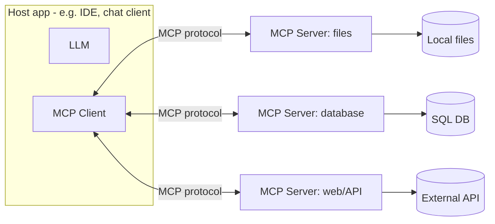

# MCP (Model Context Protocol)

MCP is an open standard that lets LLM applications connect to tools, data, and
context through a uniform interface — think "USB-C for AI." Instead of custom
glue per integration, a **host** talks to any **MCP server** the same way.

<!-- RELATED-MODULE -->

## How MCP fits together

- **Host** — the app the user interacts with (contains the LLM).
- **Client** — connector inside the host, one per server.
- **Server** — exposes capabilities over MCP; you can write your own.

## What a server exposes

| Primitive | Meaning | Example |
|-----------|---------|---------|
| **Tools** | Actions the model can call | `run_sql`, `send_email`, `search` |
| **Resources** | Readable data/context | files, rows, docs |
| **Prompts** | Reusable prompt templates | "summarize ticket" |

## Why it matters

- **Interoperability** — write a server once, use it from any MCP-compatible host.
- **Separation of concerns** — capabilities live in servers, not baked into each app.
- **Governance** — a controlled boundary for what the model can access/do.

## Interview questions

??? question "What problem does MCP solve?"
    The M×N integration problem: instead of custom code for every app-to-tool
    pairing, MCP gives one standard protocol so any host can use any server.

??? question "Tools vs resources vs prompts?"
    Tools are callable actions (side effects/queries), resources are readable
    context the model can pull in, and prompts are reusable templated instructions.

??? question "How is MCP different from plain function calling?"
    Function calling is model-native and app-specific; MCP standardizes the
    transport and discovery so tools are reusable across hosts and decoupled from
    any one model or app.

---

## Interview deep dive

### 60-second talking points

- **"MCP is USB-C for AI tools."** One standard protocol so any host can use any
  server — solves the M×N integration explosion.
- **"Capabilities live in servers, not baked into apps."** Write a server once,
  reuse everywhere; a clean governance boundary.

### Scenario & system-design questions

??? question "Your team has 5 AI apps each needing the same 6 internal tools. Why MCP?"
    Without MCP that's up to 5×6 bespoke integrations. With MCP you build **6 MCP
    servers once**; every app (host) connects via the same protocol. New apps get
    all tools for free; tool changes happen in one place.

??? question "How is MCP different from native function calling?"
    Function calling is model-/app-specific glue. MCP **standardizes transport and
    discovery**, so tools are decoupled from any one model or app and reusable
    across hosts. Function calling can be the mechanism a host uses *underneath*.

??? question "What are the security considerations when exposing tools via MCP?"
    Treat the server as a privilege boundary: **least-privilege** tool scopes,
    authn/authz on the server, validate inputs, and don't blindly trust model
    requests — an agent could be prompt-injected into calling a tool maliciously.

### Pitfalls interviewers probe

- Confusing tools (actions) vs resources (readable context) vs prompts (templates).
- Thinking MCP is a model feature (it's a protocol between host and servers).
- Over-privileged tools with no auth.

### Rapid-fire

| Q | A |
|---|---|
| Problem it solves? | M×N app-to-tool integration |
| Host / client / server? | App(+LLM) / connector / capability provider |
| Server exposes? | Tools, resources, prompts |
| vs function calling? | Standard protocol + discovery, model/app-agnostic |
