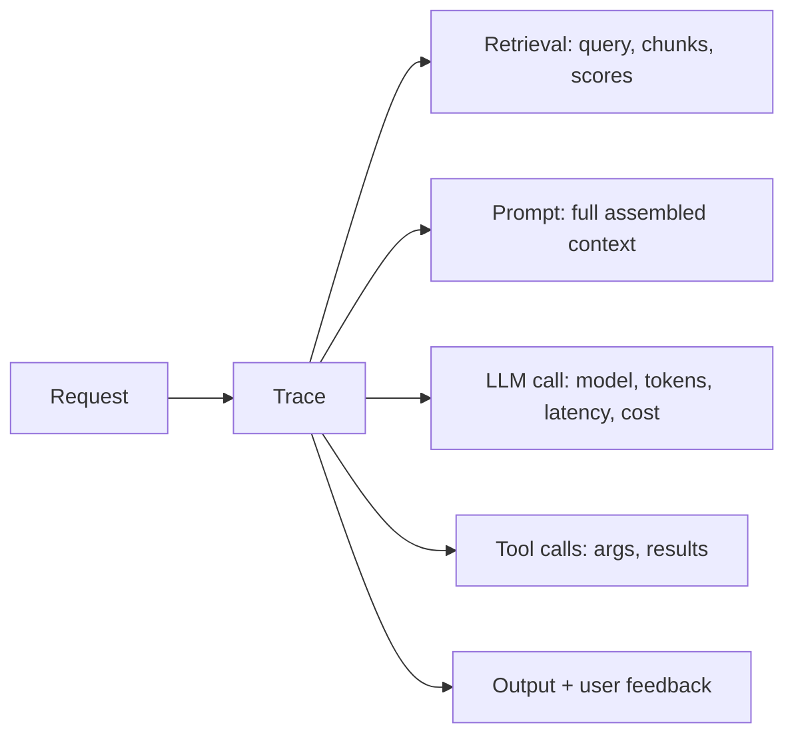

# Observability & Evaluation

You can't improve what you can't see. Observability = **tracing and monitoring**
what your LLM app does in production; evaluation = **measuring quality**
systematically. Together they turn "it feels better" into evidence.

<!-- RELATED-MODULE -->

## What to trace

A trace links every step of one request. Capture: inputs/outputs at each step,
retrieved chunks + scores, the exact prompt, model + tokens + latency + cost,
tool calls, and any errors. Tools: **LangSmith, Langfuse, Arize/Phoenix,
OpenTelemetry** (many wrap OTel).

## Evaluation methods

| Method | What | Use for |
|--------|------|---------|
| **Reference-based** | Compare to a gold answer (exact/semantic) | Tasks with known answers |
| **LLM-as-judge** | An LLM scores outputs on a rubric | Open-ended quality at scale |
| **Human eval** | People rate/label | Gold standard, expensive |
| **Heuristics** | Regex/format/validity checks | Structure, safety, guardrails |
| **A/B / online** | Compare variants on live traffic | Real-world impact |

### RAG-specific metrics

- **Retrieval:** context precision / recall.
- **Generation:** **faithfulness** (grounded in context?), **answer relevance**,
  **context relevance**. Frameworks like RAGAS operationalize these.

### Agent-specific metrics

- **Task success rate** (did it accomplish the goal?), steps/iterations, tool-call
  accuracy, cost per task.

## LLM-as-judge (done right)

Powerful but biased if naive:

- Give the judge a **clear rubric** and examples.
- Prefer **pairwise** comparison (A vs B) over absolute scores — more reliable.
- Watch for **position bias** (randomize order) and **self-preference** (a model
  favoring its own style).
- **Calibrate** against human labels on a sample.

## Guardrails & monitoring

- **Input/output guardrails** — block PII leakage, injection, toxic content,
  off-topic. (Bedrock Guardrails, NeMo Guardrails, custom checks.)
- **Monitor** cost/latency/error-rate, hallucination flags, and drift over time.
- **Feedback loop** — capture thumbs up/down and route bad cases into the eval set.

## Interview deep dive

### 60-second talking points

- **"Trace every step so you can debug the pipeline, not just the model."**
- **"Separate retrieval metrics from generation metrics."**
- **"LLM-as-judge scales eval, but use pairwise + calibrate to humans."**

### Scenario & system-design questions

??? question "How do you set up evaluation for a RAG app before and after changes?"
    Build a labeled eval set of representative questions. Measure retrieval
    (context precision/recall) and generation (faithfulness, answer relevance),
    via RAGAS-style metrics + LLM-as-judge, calibrated on a human-labeled sample.
    Run it in CI so every change is scored, not vibes.

??? question "Users report occasional wrong answers in production. How do you find and fix them?"
    Use **traces** to inspect failing requests end-to-end: was the right context
    retrieved? was the prompt correct? Add the failures to the eval set, fix the
    root cause (retrieval vs prompt vs model), and monitor the metric going
    forward. Capture user feedback to surface these.

??? question "What are the biases in LLM-as-judge and how do you mitigate them?"
    Position bias (order matters → randomize), verbosity bias (prefers longer),
    self-preference (favors own style). Use pairwise comparisons, clear rubrics,
    and calibrate against human labels.

### Pitfalls interviewers probe

- No tracing → can't tell if it's a retrieval, prompt, or model problem.
- One blended "quality" score instead of retrieval vs generation.
- Trusting LLM-as-judge without calibration.
- No production monitoring (cost/latency/drift).
- No feedback loop from real failures into evals.

### Rapid-fire

| Q | A |
|---|---|
| What to trace? | Retrieval, prompt, model call (tokens/cost/latency), tools, output |
| RAG gen metrics? | Faithfulness, answer relevance, context relevance |
| Agent metric? | Task success rate |
| LLM-as-judge best practice? | Pairwise + rubric + calibrate to humans |
| Guardrails cover? | PII, injection, toxicity, off-topic, format |
