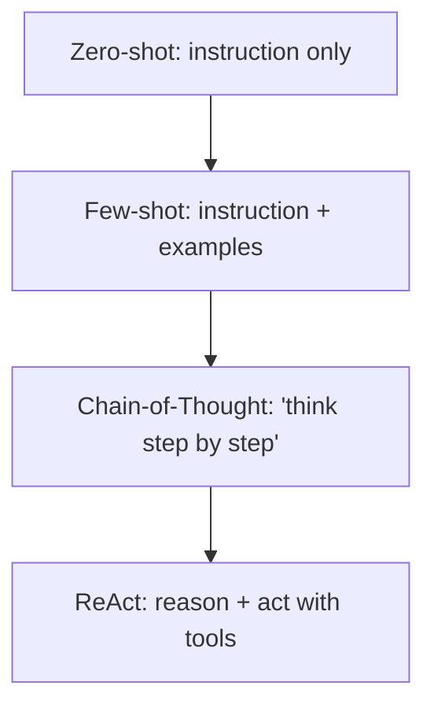

# Prompt Engineering

Prompt engineering is designing inputs that reliably get high-quality output from
an LLM — through clear instructions, examples, reasoning strategies, and
structured output constraints.

<!-- RELATED-MODULE -->

## Core techniques



| Technique | When to use |
|-----------|-------------|
| **Zero-shot** | Simple, well-known tasks |
| **Few-shot** | Show the format/style you want with 2–5 examples |
| **Chain-of-Thought** | Multi-step reasoning, math, logic |
| **ReAct** | Agentic tasks that interleave reasoning and tool calls |

## Anatomy of a good prompt

- **Role/system**: who the model is and constraints ("You are a SQL expert. Only
  answer from the provided schema.").
- **Task**: explicit, unambiguous instruction.
- **Context**: the data/grounding (RAG chunks, schema).
- **Format**: exact output shape (JSON keys, table, length).
- **Guardrails**: "If unsure, say you don't know. Don't invent columns."

## Structured output

```text
Return ONLY valid JSON:
{ "category": "<billing|technical|other>", "priority": "<low|med|high>" }
```

Constrain the output shape so downstream code can parse it. Many providers offer
JSON/function-calling modes that enforce a schema.

## Text-to-SQL notes

A common enterprise use case (and a full course project):

- Give the model the **schema** and a few example query pairs.
- Constrain to read-only, validated tables; **never** execute unvalidated SQL.
- Add a verification/execution step and return the result plus the SQL.

## Interview questions

??? question "Zero-shot vs few-shot vs chain-of-thought?"
    Zero-shot = instruction only; few-shot = add examples to fix format/behavior;
    chain-of-thought = prompt step-by-step reasoning for complex tasks.

??? question "How do you make LLM output reliable for a program to consume?"
    Constrain output to a strict schema (JSON/function calling), give an example,
    validate/parse it, and handle failures with a retry or repair prompt.

??? question "How do you reduce hallucination?"
    Ground with RAG, instruct "answer only from context / say you don't know,"
    lower temperature, request citations, and verify against source data.

---

## Interview deep dive

### 60-second talking points

- **"Structure beats cleverness."** Clear role, task, context, output format, and
  guardrails outperform 'magic' phrases.
- **"Match technique to task."** Zero-shot for simple, few-shot to fix format,
  chain-of-thought for reasoning, ReAct for tool use.
- **"Constrain the output so code can consume it."** JSON/function-calling +
  validation.

### Scenario & system-design questions

??? question "Design a reliable text-to-SQL prompt for a business analytics tool."
    Provide the **schema** and 2-3 example question→SQL pairs (few-shot); instruct
    read-only + only known tables; require the model to return SQL in a fixed
    block; then **validate/parse** and run against a sandbox with row limits;
    return both the SQL and results. Never execute unvalidated SQL.

??? question "The model returns slightly different JSON each call, breaking parsing."
    Use **structured output / function calling** to enforce a schema; give one
    exact example; lower temperature; and add a **repair step** — if parsing
    fails, re-prompt with the error. Validate with Pydantic.

??? question "How do you stop prompt injection in a RAG/agent app?"
    Treat retrieved/user content as **untrusted data, not instructions**; separate
    system instructions from context; constrain tools with least privilege; strip/
    escape; and add output checks. Assume any document can contain 'ignore your
    instructions.'

### Pitfalls interviewers probe

- Vague instructions / no output format → inconsistent results.
- Too many few-shot examples (cost, drift) or contradictory ones.
- Forgetting "say you don't know" → hallucination.
- Ignoring prompt injection from retrieved content.
- Not lowering temperature for deterministic tasks.

### Rapid-fire

| Q | A |
|---|---|
| Zero vs few-shot? | Instruction only vs with examples |
| Chain-of-thought? | Prompt step-by-step reasoning for complex tasks |
| ReAct? | Interleave reasoning + tool actions |
| Enforce JSON? | Structured output / function calling + validation |
| Prompt injection defense? | Treat context as data, least-privilege tools, output checks |
