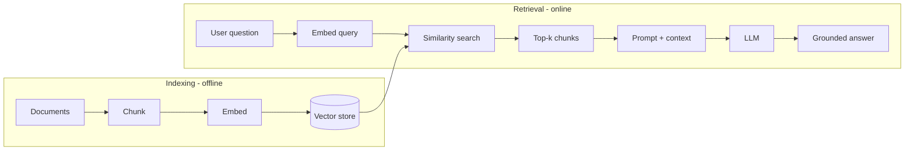

# RAG (Retrieval-Augmented Generation)

RAG grounds an LLM in your own data: instead of relying only on what the model
memorized, you **retrieve** relevant chunks at query time and put them in the
prompt so the model answers from facts you control.

<!-- RELATED-MODULE -->

## The RAG pipeline

Two phases: **index** your documents once (chunk → embed → store), then at query
time **embed the question**, retrieve the most similar chunks, and stuff them into
the prompt as grounding context.

## Design decisions that matter

| Decision | Options | Guidance |
|----------|---------|----------|
| **Chunking** | Fixed size, recursive, semantic, by heading | Overlap ~10–20%; keep chunks self-contained |
| **Embeddings** | OpenAI, Cohere, Bedrock Titan, open models | Match model to domain & language |
| **Vector store** | pgvector, Pinecone, FAISS, Cortex Search, Databricks Vector Search — see **[Vector DB](../vector-db/index.md)** | Managed vs self-hosted trade-off |
| **Retrieval** | Dense, sparse (BM25), **hybrid** | Hybrid usually wins for keywords + meaning |
| **Re-ranking** | Cross-encoder reranker | Boosts precision on the top-k |

## Improving quality

- **Hybrid search** (vector + keyword) then **re-rank** the candidates.
- **Query rewriting / expansion** for vague questions.
- **Metadata filtering** (date, source, tenant) to constrain retrieval.
- **Return citations** so answers are verifiable.
- **Evaluate**: faithfulness (grounded?), answer relevance, context precision/recall.

## Common failure modes

- Chunks too big (dilute) or too small (lose context).
- Retrieval misses because the query and docs use different vocabulary → hybrid + rewriting.
- Model ignores context → tighten the prompt ("answer only from context; say you don't know").

## Interview questions

??? question "Why RAG instead of fine-tuning?"
    RAG adds fresh, private, or frequently-changing knowledge without retraining,
    gives citations, and is cheaper to keep current. Fine-tuning changes style/
    behavior but bakes knowledge in and goes stale.

??? question "How do you evaluate a RAG system?"
    Separate retrieval and generation: measure context precision/recall for
    retrieval; faithfulness and answer relevance for generation. Use a labeled set
    and an LLM-as-judge for scale.

??? question "What is hybrid search and why use it?"
    Combine dense (semantic) and sparse (keyword/BM25) retrieval so you catch both
    meaning and exact terms (codes, names), then re-rank the merged results.

---

## Interview deep dive

### 60-second talking points

- **"RAG grounds the model in facts you control."** Retrieve relevant chunks at
  query time and put them in the prompt — fresh, private, citable, no retraining.
- **"Separate retrieval quality from generation quality."** Most RAG failures are
  *retrieval* failures; fix retrieval before blaming the LLM.

### Scenario & system-design questions

??? question "Design RAG over 100k internal documents for a support team."
    Ingest → **chunk** (heading/semantic, ~10-20% overlap) → **embed** → store in
    a vector DB with **metadata** (product, date, source). At query time: rewrite
    query, **hybrid search** (vector + BM25), **re-rank** top candidates, build a
    grounded prompt with citations, and enforce "answer only from context." Add an
    eval set for faithfulness/relevance and a feedback loop.

??? question "Users say answers are 'confidently wrong.' How do you debug?"
    First check **retrieval**: are the right chunks even being fetched? (log
    retrieved context). If not → chunking/embedding/hybrid/re-rank issues. If yes
    but the model ignores them → tighten the prompt, lower temperature, require
    citations, and add a faithfulness check.

??? question "When is RAG the wrong tool?"
    When the task needs **behavior/style change** (→ fine-tune), **whole-corpus
    reasoning** rather than a few chunks (→ different architecture / long context),
    or when the knowledge is small and static enough to fit in the prompt.

### Pitfalls interviewers probe

- Chunks too large (dilute relevance) or too small (lose context).
- Query/doc vocabulary mismatch → need hybrid search + query rewriting.
- Different embedding models for index vs query (vectors incomparable).
- No re-ranking → noisy top-k.
- No evaluation → can't tell if changes help.

### Rapid-fire

| Q | A |
|---|---|
| RAG vs fine-tuning? | RAG adds knowledge/citations; fine-tune changes behavior/style |
| Hybrid search? | Dense (semantic) + sparse (BM25), merged and re-ranked |
| Retrieval metrics? | Context precision / recall |
| Generation metrics? | Faithfulness, answer relevance |
| Reduce hallucination? | Ground + "only from context" + citations + low temp |
