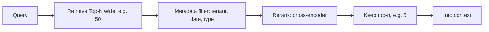

# Retrieval Tuning: Top-K, Filtering & Reranking

The three levers that most affect RAG quality after chunking/embeddings:
**how many** candidates you fetch (Top-K), **which** you keep (filtering), and
**in what order** (reranking).

<!-- RELATED-MODULE -->

## The retrieve → filter → rerank pipeline

## Top-K retrieval

**Top-K** = how many candidate chunks the vector search returns.

- **Too small** → you miss the relevant chunk entirely (recall problem).
- **Too large** → noise, cost, and "lost in the middle" dilution.
- **Pattern:** retrieve a **wide K** (e.g. 30–50) as candidates, then **rerank**
  and keep a **small n** (e.g. 3–5) for the prompt. Wide recall, narrow precision.

## Filtering (pre/post)

Constrain candidates by **metadata** alongside similarity:

- **Pre-filter** — restrict the search space before/within the vector search
  (e.g. `tenant_id = X`, `date > ...`, `doc_type = 'policy'`). Essential for
  multi-tenant isolation and freshness.
- **Post-filter** — drop results after retrieval (simpler, but can leave you with
  fewer than n if the filter is aggressive).

Filtering is about **correctness and security**, not just relevance — a missing
tenant filter leaks data.

## Reranking

The first-stage retriever (bi-encoder / vector similarity) is fast but
approximate. A **reranker** (cross-encoder) scores each (query, chunk) pair
jointly — slower but far more accurate — and reorders the candidates.

| Stage | Model | Speed | Accuracy |
|-------|-------|-------|----------|
| Retrieve | Bi-encoder (embeddings) | Fast (index) | Approximate |
| Rerank | Cross-encoder | Slow (per pair) | High |

Because reranking is expensive per pair, you **only rerank the Top-K
candidates**, not the whole corpus. Options: Cohere Rerank, cross-encoder models,
or an LLM as reranker.

## Filtering vs reranking (the key distinction)

- **Filtering** = binary include/exclude by metadata (correctness, security).
- **Reranking** = reorder by relevance score (quality). 

They're complementary: filter to the *allowed and fresh* set, then rerank that
set for *best first*.

## Interview deep dive

### Talking points
- **"Retrieve wide, rerank narrow."** High recall then high precision.
- **"Filtering is correctness/security; reranking is quality."**
- **"Reranking is a cross-encoder on the Top-K, not the whole corpus."**

### Scenario questions

??? question "Recall is fine but the best answer is buried at rank 8. What do you add?"
    A **reranker** (cross-encoder). The bi-encoder retrieved the right chunk but
    scored it imprecisely; a cross-encoder rescoring the Top-K promotes it. Keep a
    small top-n after reranking.

??? question "Multi-tenant RAG occasionally returns another tenant's doc. Fix?"
    **Pre-filter** by `tenant_id` inside the vector query (metadata filter), not
    just in the UI. This is a security bug, not a relevance one.

??? question "How do you choose K?"
    Big enough for recall (measure context recall on an eval set), then rerank down
    to the smallest n that keeps faithfulness high — balancing cost and "lost in
    the middle."

### Rapid-fire

| Q | A |
|---|---|
| Top-K? | How many candidates retrieval returns |
| Retrieve wide, then? | Rerank and keep a small top-n |
| Filtering vs reranking? | Include/exclude by metadata vs reorder by relevance |
| Reranker type? | Cross-encoder (joint query-chunk scoring) |
| Why not rerank everything? | Cross-encoders are expensive per pair |
