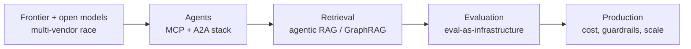

# GenAI Trends & Market (2026 snapshot)

!!! warning "This is a point-in-time snapshot"
    GenAI moves fast — model names and numbers below reflect **~mid/late 2026**
    and will age quickly. Treat this as a *pattern* map, not a live feed. Always
    re-verify specific versions/prices against vendor docs before an interview.
    Sources are linked inline.

The point of this page: walk into an interview able to talk about **where the
field actually is right now**, not where it was in 2023.

## The big picture

The through-line: the industry has moved from "can the model do it?" to
"**can you ship it reliably, cheaply, and safely in production?**"

## 1. Models: no more two-horse race

The frontier is now a **multi-vendor field**, with strong **open-weight** models
competing on price/performance rather than a single leader.

| Tier | Examples (2026) | Typical use |
|------|-----------------|-------------|
| Frontier reasoning/coding | GPT-5.x, Claude Opus 4.x, Gemini 3.x Pro | Hard reasoning, codebase-level tasks |
| Cost-efficient workhorse | Claude Sonnet, Gemini Flash, GPT mini tiers | High-volume, latency-sensitive |
| Open-weight / self-host | Llama, Qwen 3.x, DeepSeek V4, Mistral Large 3 | Private/air-gapped, price-sensitive |

Talking points, grounded in current comparisons
([azumo.com](https://azumo.com/artificial-intelligence/ai-insights/top-10-llms-0625),
[aimlapi.com](https://aimlapi.com/blog/top-llm-models-in-2026-the-best-ai-models-for-reasoning-coding-multimodal-tasks)):

- **Pick by workload, not brand.** A frontier model for hard reasoning, a
  cheaper model for classification/extraction, an open model when data can't
  leave your walls.
- **Open-weight caught up** for many tasks — the gap to closed frontier models
  narrowed enough that cost and control often decide.
- **Multimodality is table stakes** — leading models reason across text, images,
  documents, audio, and video in one call
  ([aimlapi.com](https://aimlapi.com/blog/best-llms-for-long-context-multimodal-tasks-in-2026)).

*Content rephrased and summarized for licensing compliance.*

## 2. Agents: the protocol stack is real now

The biggest shift since 2024: agents got **open standards**. The default 2026
enterprise stack is two complementary protocols
([beam.ai](https://beam.ai/agentic-insights/agent2agent-vs-mcp-2026-ai-agent-stack),
[gainam.com](https://gainam.com/insights/mcp-vs-a2a-protocols)):

| Protocol | Connects | Role |
|----------|----------|------|
| **MCP** (Anthropic) | agent → tools/data | "USB-C for tools"; ~97M+ downloads reported |
| **A2A** (Google → Linux Foundation) | agent → agent | cross-vendor agent coordination; 150+ orgs |
| **ACP** | agent → agent (intra-enterprise) | REST-style messaging inside one org |

- **They're layers, not competitors** — a serious deployment runs MCP *and* A2A
  ([beam.ai](https://beam.ai/agentic-insights/agent2agent-vs-mcp-2026-ai-agent-stack)).
- **The pilot-to-production gap is the story:** reports put ~63% of enterprises
  piloting agents but **under 25% scaled to production**
  ([jangwook.net](https://jangwook.net/en/blog/en/a2a-mcp-hybrid-architecture-production-guide/)).
  Closing that gap — reliability, cost, governance — is where the jobs are.
- **Supervised multi-agent** patterns win: one plans, one retrieves, one
  executes, one evaluates before a human approves
  ([acecloud.ai](https://acecloud.ai/blog/agentic-ai-trends/)).

## 3. RAG fractured into a toolkit

RAG is still the dominant grounding pattern, but "RAG" now means a **family** of
patterns with very different cost/latency/quality tradeoffs
([starmorph.com](https://blog.starmorph.com/blog/rag-techniques-compared-best-practices-guide)):

- **Agentic RAG** — the agent decides *whether/what/how many times* to retrieve.
- **GraphRAG** — retrieve over a knowledge graph for multi-hop questions.
  Microsoft's research showed a large multi-hop accuracy jump by grounding in a
  graph ([atolio.com](https://www.atolio.com/blog/enterprise-rag-guide)).
- **Hybrid search + reranking** — BM25 + vector, then a cross-encoder reranker
  (meaningful accuracy gains for modest latency)
  ([atolio.com](https://www.atolio.com/blog/enterprise-rag-guide)).

A common 2026 stack: **LangGraph** to orchestrate, a retrieval framework for the
RAG, and **RAGAS / Phoenix / Langfuse** for evaluation
([marsdevs.com](https://www.marsdevs.com/guides/agentic-rag-2026-guide)).

## 4. Evaluation is now infrastructure, not an afterthought

The teams shipping reliable systems treat eval like testing — built in, not
bolted on ([medium.com](https://medium.com/@basukori8463/rag-evaluation-the-complete-guide-to-ragas-trulens-llm-as-judge-2026-edition-068b6e9dc5d0)):

- **Offline eval** — RAGAS/TruLens metrics (faithfulness, answer relevancy,
  context precision), **LLM-as-judge** for open-ended output.
- **Online eval** — tracing (Langfuse, Phoenix, LangSmith), user feedback,
  regression checks per release.
- **Targets people quote:** faithfulness ≈0.9, answer relevancy ≈0.85
  ([marsdevs.com](https://www.marsdevs.com/guides/agentic-rag-2026-guide)).

## 5. The job market read

From current interview guides
([interviewcoder.co](https://www.interviewcoder.co/blog/agentic-ai-interview-questions),
[tekrecruiter.com](https://www.tekrecruiter.com/post/ai-engineer-interview-questions),
[lockedinai.com](https://www.lockedinai.com/blog/ai-engineer-interview-questions)):

- Senior **agentic AI** roles are paying strongly (reports cite ~$140–300k for
  senior engineers) and the bar rose fast.
- Interviews **prioritize applied production skills** — RAG systems, agent loops,
  evaluation, inference endpoints, cost control — over classic ML theory like
  gradient descent or CNNs.
- Interviewers want **war stories**: have you actually shipped an autonomous
  loop and dealt with its failure modes? Reciting "ReAct" isn't enough.

*All figures paraphrased from the linked sources; verify before quoting.*

## Interview deep dive

### Talking points
- **"Model choice is a workload decision."** Frontier for hard reasoning, cheap
  tiers for volume, open-weight for private data.
- **"MCP connects agents to tools; A2A connects agents to each other — modern
  stacks run both."**
- **"The hard part isn't a demo, it's production"** — reliability, eval, cost,
  governance. That's why most agent pilots haven't scaled.
- **"Eval is infrastructure."** Name RAGAS/LLM-as-judge + tracing; give target
  metrics.

### Rapid-fire

| Q | A |
|---|---|
| Two-protocol agent stack? | MCP (tools) + A2A (agent-to-agent) |
| Why do agent pilots stall? | Reliability, cost, governance — not model quality |
| RAG for multi-hop questions? | GraphRAG |
| How do you prove a RAG answer is grounded? | Faithfulness metric + LLM-as-judge |
| What do 2026 interviews test most? | Applied production skills, not ML theory |

### How to keep this current
- Skim a model-comparison site + one agent-protocol source monthly.
- Track the vendor blogs (OpenAI, Anthropic, Google DeepMind, Meta, Mistral).
- Re-run this page's questions against the [retrieval agent](../../Start-Here/index.md).
