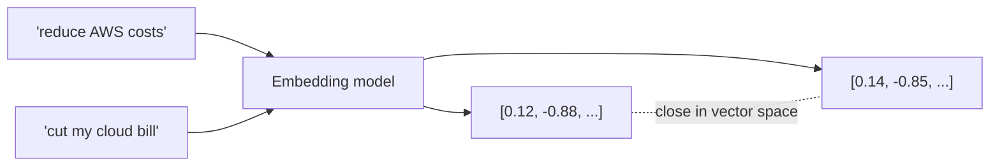

# Vector Databases

A vector database stores **embeddings** — numeric vectors that capture the
*meaning* of text, images, or other data — and finds the ones most similar to a
query vector. They're the storage/retrieval engine behind semantic search and
RAG.

<!-- RELATED-MODULE -->

## Why vectors?

Traditional databases match **exact** values (`WHERE name = 'Alice'`). But
"how do I cut my cloud bill?" and "reduce AWS costs" share no keywords yet mean
the same thing. Embeddings map both to nearby points in a high-dimensional space,
so **similarity search** finds semantically related content.



## How similarity search works

1. **Embed** documents (offline) → store vectors + metadata.
2. **Embed** the query (online) → one vector.
3. **Search** for nearest neighbors using a distance metric.
4. Return the top-k with their source text and metadata.

### Distance metrics

| Metric | Meaning | Common for |
|--------|---------|-----------|
| **Cosine similarity** | Angle between vectors (ignores magnitude) | Text embeddings (most common) |
| **Dot product** | Cosine × magnitudes | When magnitude matters |
| **Euclidean (L2)** | Straight-line distance | Image/spatial data |

## ANN indexes (the performance trick)

Exact nearest-neighbor search over millions of vectors is slow. Vector DBs use
**Approximate Nearest Neighbor (ANN)** indexes that trade a tiny bit of accuracy
for huge speed:

| Index | Idea | Trade-off |
|-------|------|-----------|
| **HNSW** | Hierarchical navigable small-world graph | Fast + accurate; more memory |
| **IVF** | Partition into clusters, search a few | Faster build; tune `nprobe` |
| **IVF-PQ** | IVF + product quantization (compress) | Low memory; some recall loss |
| **Flat** | Brute force, exact | Small datasets / ground truth |

**Recall vs latency** is the core tuning dial: higher recall (more accurate)
usually means higher latency/memory. HNSW's `ef_search` and IVF's `nprobe`
control it.

## Choosing a vector store

| Option | Type | Notes |
|--------|------|-------|
| **pgvector** | Postgres extension | Great if you already run Postgres; SQL + vectors together |
| **FAISS** | Library (in-process) | Fast, local, no server; you manage persistence |
| **Chroma** | Lightweight, embedded/local | Easy for prototyping |
| **Pinecone** | Managed cloud | Zero-ops, scales; paid |
| **Milvus / Weaviate / Qdrant** | Self-host or managed | Feature-rich, filtering, hybrid |
| **Snowflake Cortex Search** | In-warehouse | Governed, no data movement |
| **Databricks Vector Search** | In-lakehouse | Governed alongside Delta data |

## Metadata filtering & hybrid search

- **Metadata filters** — restrict search by tenant, date, source, doc type
  (`WHERE source = 'policy' AND date > ...`) alongside vector similarity.
- **Hybrid search** — combine vector (semantic) with keyword/BM25 (lexical) and
  merge/re-rank. Catches exact terms (codes, names) that pure vectors miss.

```sql
-- pgvector example: nearest neighbors by cosine distance
SELECT id, chunk, 1 - (embedding <=> :query_vec) AS similarity
FROM documents
WHERE tenant_id = :tenant           -- metadata filter
ORDER BY embedding <=> :query_vec    -- <=> = cosine distance
LIMIT 5;
```

## Practical guidance

- **Chunk size drives quality** — the vector represents a chunk; keep chunks
  self-contained (see [RAG](../rag/index.md)).
- **Match the embedding model** to your domain/language, and **use the same
  model** for indexing and querying.
- **Store metadata** with every vector so you can filter and cite.
- **Normalize** vectors if your metric assumes it (cosine).
- **Re-embed** when you change models — vectors from different models aren't
  comparable.

## Interview questions

??? question "What is a vector database and why not just use SQL?"
    It stores embeddings and finds nearest neighbors by semantic similarity, not
    exact matches. SQL `=`/`LIKE` can't capture meaning; vector search returns
    conceptually related items even with no shared keywords.

??? question "What is ANN and why is it needed?"
    Approximate Nearest Neighbor search. Exact search over millions of vectors is
    too slow; ANN indexes (HNSW, IVF) trade a little recall for large speed gains.

??? question "Cosine vs Euclidean vs dot product — when?"
    Cosine for text embeddings (direction = meaning, magnitude ignored); dot
    product when magnitude carries signal; Euclidean for spatial/image data.

??? question "How do metadata filters and hybrid search improve retrieval?"
    Filters constrain results to the right subset (tenant, date, type). Hybrid
    search merges semantic and keyword results so exact terms aren't missed, then
    re-ranks.

??? question "Common causes of poor vector-search results?"
    Bad chunking, mismatched embedding models between index and query, missing
    normalization, no metadata filtering, or relying on pure vectors where keyword
    matching is needed.

---

## Interview deep dive

### 60-second talking points

- **"Vectors capture meaning; search finds nearest neighbors."** Similar meaning →
  nearby points, so you retrieve by concept, not keyword.
- **"ANN trades a little recall for huge speed."** Exact search doesn't scale;
  HNSW/IVF make it fast.
- **"Metadata + hybrid make it production-grade."** Filter by tenant/date and
  merge with keyword search so exact terms aren't missed.

### Scenario & system-design questions

??? question "Choose a vector store for a multi-tenant SaaS RAG feature."
    Need **metadata filtering** (tenant isolation), scale, and low ops. If already
    on Postgres → **pgvector** (SQL + vectors, filter in one place). For managed
    scale → Pinecone/Qdrant/Weaviate. If data lives in Snowflake/Databricks →
    **Cortex Search / Databricks Vector Search** to keep governance. Always filter
    by `tenant_id` in the query.

??? question "Recall is poor at high QPS. What knobs do you turn?"
    Tune the ANN index: HNSW `ef_search` up (better recall, slower) or `M` at
    build; IVF `nprobe` up (search more clusters). Trade latency for recall,
    right-size the index in memory, and consider re-ranking the top-k to recover
    precision.

??? question "Search quality dropped after you switched embedding models. Why?"
    Vectors from different models aren't comparable — you must **re-embed the whole
    corpus** with the new model and query with the same one. Mixed vectors give
    garbage neighbors.

### Pitfalls interviewers probe

- Mismatched embedding models between index and query.
- No metadata filtering (multi-tenant leakage, irrelevant results).
- Wrong distance metric (use cosine for normalized text embeddings).
- Ignoring recall/latency trade-off (default `nprobe`/`ef` too low or high).
- Treating the vector DB as the only retrieval path (skip hybrid/keyword).

### Rapid-fire

| Q | A |
|---|---|
| Why not SQL for this? | Exact match can't capture semantic similarity |
| ANN indexes? | HNSW (graph), IVF (clusters), IVF-PQ (compressed), Flat (exact) |
| Metric for text? | Cosine similarity |
| Recall vs latency knob? | HNSW `ef_search` / IVF `nprobe` |
| Change embedding model → | Re-embed everything |
