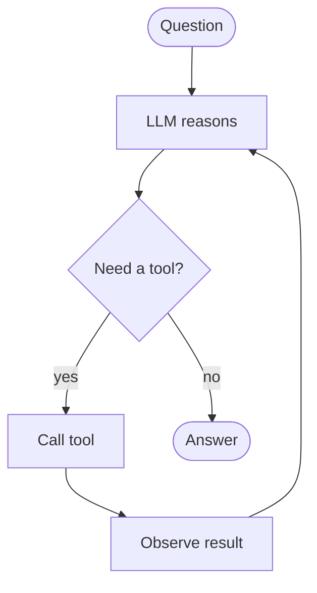

# Build Your First Agent

An agent is a control loop: the LLM decides which **tool** to call, sees the
result, and repeats until it can answer. Concepts:
[Agent Engineering](../../GenAI-Topics/agent-engineering/index.md).



## Option A — LangGraph (recommended)

```bash
pip install langgraph langchain-aws
```

```python
from langchain_aws import ChatBedrock
from langchain_core.tools import tool
from langgraph.prebuilt import create_react_agent

llm = ChatBedrock(model_id="anthropic.claude-3-5-sonnet-20240620-v1:0",
                  region_name="us-west-2", model_kwargs={"temperature": 0})

@tool
def get_weather(city: str) -> str:
    """Return the current weather for a city."""
    return f"It's 72F and sunny in {city}."   # stub — call a real API here

@tool
def add(a: int, b: int) -> int:
    """Add two numbers."""
    return a + b

agent = create_react_agent(llm, tools=[get_weather, add])

result = agent.invoke({"messages": [("user",
    "What's the weather in Portland, and what's 21 + 21?")]})
print(result["messages"][-1].content)
```

The agent decides to call `get_weather` and `add`, then composes the answer.

## Tool design (the part that matters)

- **Clear name + docstring** — the model picks tools from these.
- **Narrow & single-purpose** — `get_order_status(id)` beats `do_everything()`.
- **Typed args, structured returns**, informative errors.
- **Read vs write** — gate any tool that changes state.

## Make it production-safe

```python
# cap iterations so the agent can't loop forever
agent = create_react_agent(llm, tools=[...])
result = agent.invoke({"messages": [...]},
                      config={"recursion_limit": 8})
```

- **Iteration + cost caps** (above) stop runaways.
- **Human-in-the-loop** before irreversible actions.
- **Trace every step** for debugging/eval.
- **Deterministic fallback** if the agent stalls.

## Chain vs agent

Use a **chain** if the steps are fixed (prompt → retrieve → answer). Use an
**agent** only when the model must *decide* which tools to call — it costs more
and needs the guardrails above.

## Where to go next

- Add **retrieval as a tool** → agentic RAG.
- Multiple agents that coordinate → [A2A](../../GenAI-Topics/a2a/index.md).
- Deploy behind an API → [FastAPI](../../Technologies/fastapi/index.md),
  [LLMOps](../../GenAI-Topics/llmops/index.md).
