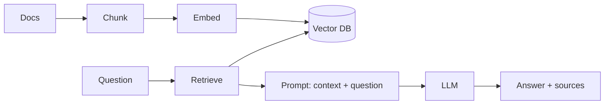

# Build Your First RAG App

Put the pieces together: ingest documents, retrieve relevant chunks, and answer
with an LLM — grounded and cited. The full flow is on the
[RAG Flow](../../Documentation/rag-flow/index.md) page.



## 1. Ingest (index your docs, once)

```python
from langchain_community.document_loaders import TextLoader
from langchain_text_splitters import RecursiveCharacterTextSplitter
from langchain_community.vectorstores import Chroma
from langchain_community.embeddings import BedrockEmbeddings

emb = BedrockEmbeddings(model_id="amazon.titan-embed-text-v2:0",
                        region_name="us-west-2")

docs = TextLoader("data/handbook.txt").load()
chunks = RecursiveCharacterTextSplitter(
    chunk_size=800, chunk_overlap=120).split_documents(docs)

vs = Chroma.from_documents(chunks, embedding=emb, persist_directory="./chroma")
```

## 2. Retrieve + answer (per question)

```python
from langchain_aws import ChatBedrock
from langchain_core.prompts import ChatPromptTemplate

llm = ChatBedrock(model_id="anthropic.claude-3-5-sonnet-20240620-v1:0",
                  region_name="us-west-2", model_kwargs={"temperature": 0})

prompt = ChatPromptTemplate.from_template(
    "Answer ONLY from the context. If it's not there, say you don't know.\n\n"
    "Context:\n{context}\n\nQuestion: {question}"
)

def ask(question: str) -> str:
    hits = vs.similarity_search(question, k=4)
    context = "\n\n".join(d.page_content for d in hits)
    msg = prompt.format_messages(context=context, question=question)
    answer = llm.invoke(msg).content
    sources = [d.metadata.get("source", "?") for d in hits]
    return f"{answer}\n\nSources: {sources}"

print(ask("What is the refund policy?"))
```

## 3. Make it better (in order of impact)

1. **Hybrid search** — add keyword/BM25 alongside vectors.
2. **Rerank** — retrieve wide (k=30), rerank down to 4 (see
   [Retrieval Tuning](../../GenAI-Topics/retrieval-tuning/index.md)).
3. **Metadata filters** — restrict by tenant/date/source.
4. **Evaluate** — build a small Q&A set; measure faithfulness (see
   [Observability & Eval](../../GenAI-Topics/observability/index.md)).

## Common gotchas

- Chunks too big/small → tune `chunk_size` / `chunk_overlap`.
- Different embedding model for index vs query → re-embed everything.
- Model ignores context → tighten the "only from context" instruction, temp 0.

## Next

→ [First Agent](../first-agent/index.md) — let the model use tools, not just retrieve.
