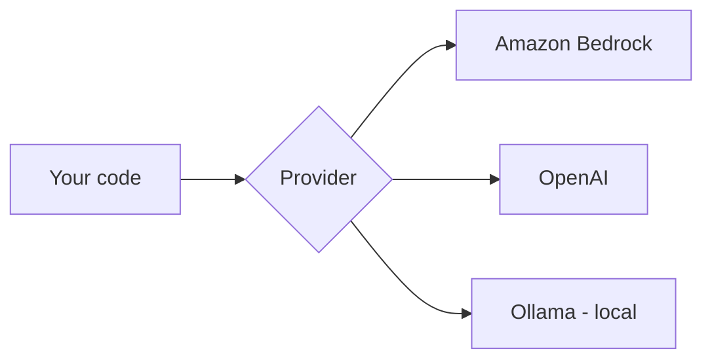

# LLM Access Setup

Make your first model call. Pick the provider you have — the rest of the guides
work with any of them.



=== "Amazon Bedrock"

    **1. Authenticate** (SSO example):
    ```bash
    aws sso login --profile my-profile
    ```

    **2. Confirm model access** in the Bedrock console (request access to
    Claude/Titan/etc. once per account).

    **3. Call it:**
    ```python
    import boto3, json
    rt = boto3.client("bedrock-runtime", region_name="us-west-2")
    resp = rt.invoke_model(
        modelId="anthropic.claude-3-5-sonnet-20240620-v1:0",
        body=json.dumps({
            "anthropic_version": "bedrock-2023-05-31",
            "max_tokens": 200,
            "messages": [{"role": "user", "content": "Say hello in one line."}],
        }),
    )
    print(json.loads(resp["body"].read())["content"][0]["text"])
    ```

=== "OpenAI"

    ```bash
    pip install openai
    # set OPENAI_API_KEY in your .env
    ```
    ```python
    from openai import OpenAI
    client = OpenAI()  # reads OPENAI_API_KEY
    r = client.chat.completions.create(
        model="gpt-4o-mini",
        messages=[{"role": "user", "content": "Say hello in one line."}],
    )
    print(r.choices[0].message.content)
    ```

=== "Ollama (local, no key)"

    ```bash
    # install from ollama.com, then:
    ollama pull llama3
    ```
    ```python
    import requests, json
    r = requests.post("http://localhost:11434/api/generate",
        json={"model": "llama3", "prompt": "Say hello in one line.", "stream": False})
    print(r.json()["response"])
    ```

## One interface via LangChain (optional)

LangChain lets you swap providers without changing app code:

```python
from langchain_aws import ChatBedrock          # Bedrock
# from langchain_openai import ChatOpenAI       # OpenAI
llm = ChatBedrock(model_id="anthropic.claude-3-5-sonnet-20240620-v1:0",
                  region_name="us-west-2")
print(llm.invoke("Say hello in one line.").content)
```

## Sanity checklist

- [ ] Credentials/keys load from `.env` (not hard-coded)
- [ ] A first call returns text
- [ ] Region + model id are correct
- [ ] For factual tasks, set **temperature 0**

## Next

→ [Vector DB Setup](../vector-db-setup/index.md) — store embeddings for retrieval.
