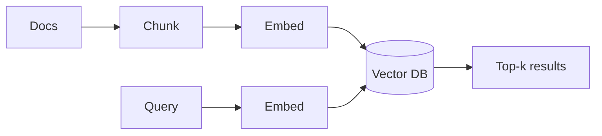

# Vector DB Setup

Stand up a vector store and load embeddings — the retrieval backend for RAG.
Concepts are in [Vector DB](../../GenAI-Topics/vector-db/index.md); this is the
hands-on setup.



Pick one — **Chroma** or **FAISS** for local/quick, **pgvector** if you already
run Postgres.

=== "Chroma (easiest local)"

    ```bash
    pip install chromadb langchain-community
    ```
    ```python
    from langchain_community.vectorstores import Chroma
    from langchain_community.embeddings import BedrockEmbeddings  # or OpenAIEmbeddings

    emb = BedrockEmbeddings(model_id="amazon.titan-embed-text-v2:0",
                            region_name="us-west-2")
    docs = ["Snowflake separates storage and compute.",
            "RAG grounds an LLM in your own data."]
    vs = Chroma.from_texts(docs, embedding=emb, persist_directory="./chroma")
    print(vs.similarity_search("what is RAG?", k=1))
    ```

=== "FAISS (in-memory / file)"

    ```bash
    pip install faiss-cpu langchain-community
    ```
    ```python
    from langchain_community.vectorstores import FAISS
    vs = FAISS.from_texts(docs, embedding=emb)
    vs.save_local("faiss_index")
    print(vs.similarity_search("what is RAG?", k=1))
    ```

=== "pgvector (Postgres)"

    ```sql
    CREATE EXTENSION IF NOT EXISTS vector;
    CREATE TABLE documents (
        id bigserial PRIMARY KEY,
        chunk text,
        embedding vector(1024),      -- match your embedding model's dims
        tenant_id text,
        source text
    );
    ```
    ```sql
    -- nearest neighbors by cosine distance, filtered by tenant
    SELECT chunk, 1 - (embedding <=> :qvec) AS similarity
    FROM documents
    WHERE tenant_id = :tenant
    ORDER BY embedding <=> :qvec
    LIMIT 5;
    ```

## Key setup rules

- **Same embedding model for index and query** — or vectors don't compare.
- **Match dimensions** — the table/index vector size must equal the model's output.
- **Store metadata** (tenant, source, date) so you can filter and cite.
- **Cosine** for normalized text embeddings.

## Next

→ [First RAG App](../first-rag/index.md) — put it together into a Q&A app.
