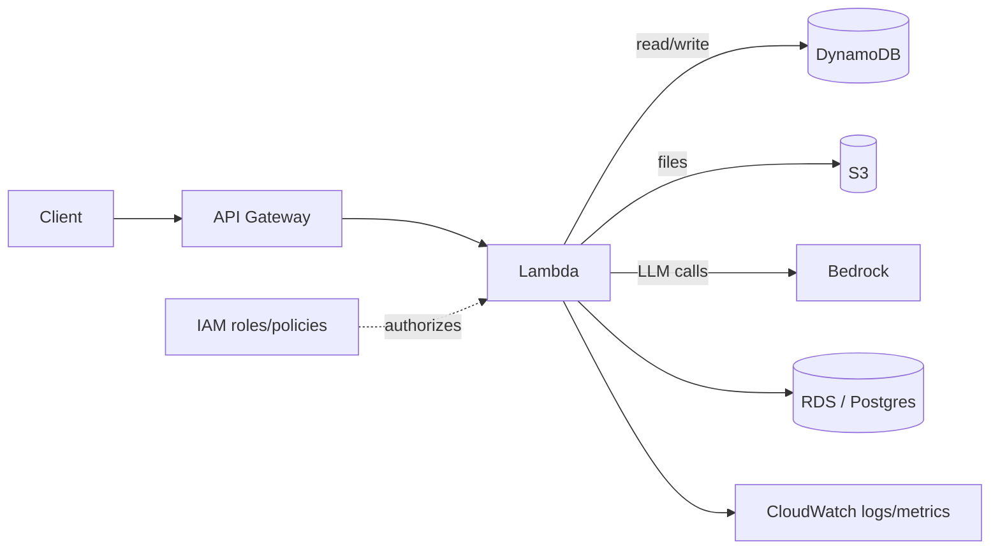

# AWS

Amazon Web Services is the cloud foundation for most of this material — Lambda,
S3, IAM, and Bedrock show up across the GenAI projects. This page covers the core
services, serverless patterns, GenAI on AWS, security, and deployment, with
interview prep.

## A typical serverless GenAI stack



This is the shape of the Lambda + API + Postgres and text-to-SQL projects in the
course: API Gateway fronts a Lambda, which talks to storage and Bedrock, all
governed by IAM.

## Core services cheat sheet

| Category | Service | Use for |
|----------|---------|---------|
| **Compute** | Lambda, ECS/Fargate, EC2 | Functions, containers, VMs |
| **Storage** | S3, EBS, EFS | Object, block, file storage |
| **Database** | RDS, DynamoDB, Aurora | Relational, NoSQL, serverless SQL |
| **Integration** | API Gateway, SQS, SNS, EventBridge | APIs, queues, pub/sub, events |
| **GenAI/ML** | Bedrock, SageMaker | Foundation models, custom ML |
| **Security** | IAM, KMS, Secrets Manager, Cognito | Access, encryption, secrets, auth |
| **Ops** | CloudWatch, CloudFormation, CDK | Monitoring, infrastructure-as-code |

## Lambda patterns

- **Stateless & event-driven** — triggered by API Gateway, S3 events, SQS,
  EventBridge schedules, etc.
- **Cold starts** — first invoke is slower; mitigate with smaller packages and
  provisioned concurrency for latency-sensitive paths.
- **Least-privilege execution role** — each function gets only the permissions
  it needs.
- **Layers** for shared dependencies; keep the deployment package lean.
- **Idempotency** — design handlers so retries (SQS, EventBridge) are safe.

```python
import json

def handler(event, context):
    body = json.loads(event.get("body") or "{}")
    # ... do work, call other AWS services via boto3 ...
    return {"statusCode": 200, "body": json.dumps({"ok": True})}
```

## S3 essentials

- **Buckets & keys**; storage classes (Standard → Glacier) for cost tiering.
- **Lifecycle rules** to transition/expire objects automatically.
- **Event notifications** to trigger Lambda on upload.
- **Security**: block public access by default, bucket policies, SSE-KMS
  encryption, presigned URLs for temporary access.

## GenAI on AWS — Bedrock

The managed foundation-model service (Claude, Llama, Titan, Mistral) — one API,
plus Knowledge Bases (managed RAG), Agents, and Guardrails. See the dedicated
**[Bedrock](../../GenAI-Topics/bedrock/index.md)** topic for detail.

```python
import boto3, json
rt = boto3.client("bedrock-runtime")
resp = rt.invoke_model(
    modelId="anthropic.claude-3-5-sonnet-20240620-v1:0",
    body=json.dumps({
        "anthropic_version": "bedrock-2023-05-31",
        "max_tokens": 300,
        "messages": [{"role": "user", "content": "Summarize S3 in two lines."}],
    }),
)
```

## IAM & security

- **Principals, policies, roles**: grant permissions to **roles** and have
  services assume them — avoid long-lived access keys.
- **Least privilege**: scope actions and resources tightly; deny by default.
- **KMS** for encryption keys; **Secrets Manager** for DB creds/API keys (never
  hard-code them).
- **VPC** for network isolation; security groups as stateful firewalls.
- **Cognito** for application user authentication.

## Deployment (Infrastructure as Code)

- **CloudFormation** — declarative YAML/JSON stacks.
- **AWS SAM** — serverless-focused shorthand over CloudFormation.
- **CDK** — infrastructure in real code (Python/TypeScript).
- Prefer IaC over console clicks for repeatability and peer review.

## Well-Architected pillars

Operational excellence, **security**, reliability, performance efficiency, cost
optimization, and sustainability — the checklist AWS uses to review designs.

## Interview questions

??? question "When would you choose Lambda vs a container (ECS/Fargate) vs EC2?"
    Lambda for short, event-driven, spiky work (pay per invoke, no servers to
    manage). Fargate for longer-running containers without managing hosts. EC2
    when you need full control over the OS/instance or specialized hardware.

??? question "How do you secure secrets and credentials in an AWS app?"
    Never hard-code them. Use IAM roles for service-to-service access, Secrets
    Manager (or SSM Parameter Store) for DB creds/API keys, and KMS for
    encryption. Rotate secrets and scope access with least privilege.

??? question "What causes Lambda cold starts and how do you reduce them?"
    A cold start happens when a new execution environment initializes (first call
    or after scale-out). Reduce with smaller packages, fewer heavy imports at
    module load, and provisioned concurrency for latency-sensitive endpoints.

??? question "How would you design a serverless REST API with a database?"
    API Gateway → Lambda → RDS/DynamoDB, with an IAM execution role, secrets in
    Secrets Manager, CloudWatch for logs/metrics, and SAM/CDK for deployment.
    That's the pattern used in the course's Lambda + Postgres project.

??? question "S3 security best practices?"
    Block public access by default, use bucket policies + IAM for access,
    SSE-KMS encryption at rest, presigned URLs for temporary sharing, and
    lifecycle rules for retention/cost.

## Related course modules

- **[MODULE2-AWS-CLOUD](../../Course-Modules/module2-aws-cloud.md)** — the core
  AWS cloud module.
- **[MODULE3-PYTHON](../../Course-Modules/module3-python.md)** — includes the
  AWS Lambda + API + Postgres project.
- **[MODULE10-BEDROCK-N-AGENTCORE](../../Course-Modules/module10-bedrock-n-agentcore.md)**
  — Bedrock and AgentCore on AWS.

---

## Interview deep dive

### 60-second talking points

- **"Grant roles, not keys."** Services assume IAM roles; no long-lived
  credentials. Least privilege by default.
- **"Serverless = pay for use, scale to zero."** Lambda + API Gateway + managed
  DBs remove server management; you design for statelessness and idempotency.
- **"Well-Architected is the checklist."** Security, reliability, performance,
  cost, operational excellence, sustainability.

### Scenario & system-design questions

??? question "Design a scalable REST API that calls an LLM and stores results."
    Client → **API Gateway** → **Lambda** (async client for the model call) →
    **Bedrock** for inference → **DynamoDB/RDS** for results; **Secrets Manager**
    for creds, **CloudWatch** for logs/metrics, **SQS** to buffer spikes, and
    provisioned concurrency if latency matters. IaC with SAM/CDK.

??? question "How do you handle a Lambda that occasionally times out calling a slow API?"
    Set sane function timeout + client timeout; make it **idempotent** and put an
    **SQS queue with a DLQ** in front so retries are safe; consider **Step
    Functions** for long/multi-step orchestration instead of one long Lambda.

??? question "A team leaked an access key in a repo. What's the right design so this can't happen?"
    Eliminate static keys: use **IAM roles** for compute, **OIDC** for CI/CD,
    **Secrets Manager** for app secrets, and **SCPs**/permission boundaries to cap
    blast radius. Rotate + scan (git-secrets). Detective controls via CloudTrail.

??? question "How do you make S3 data secure by default?"
    Block Public Access at account + bucket level, bucket policies + IAM for
    access, **SSE-KMS** encryption, presigned URLs for temporary sharing, VPC
    endpoints to keep traffic private, and lifecycle rules for retention.

### Pitfalls interviewers probe

- Hardcoding credentials instead of roles/Secrets Manager.
- Assuming Lambda is stateful or ordered (it's neither by default).
- Ignoring cold starts on latency-critical paths.
- Over-broad IAM (`*` actions/resources).
- No idempotency → duplicate processing on retries.

### Rapid-fire

| Q | A |
|---|---|
| Lambda vs Fargate vs EC2? | Event/spiky vs long containers vs full control |
| SQS vs SNS? | Queue (pull, one consumer group) vs pub/sub (push, fan-out) |
| Reduce cold starts? | Smaller package, provisioned concurrency, lighter imports |
| Secrets in AWS? | Secrets Manager / SSM Parameter Store + KMS, never hardcode |
| IaC options? | CloudFormation, SAM, CDK |
