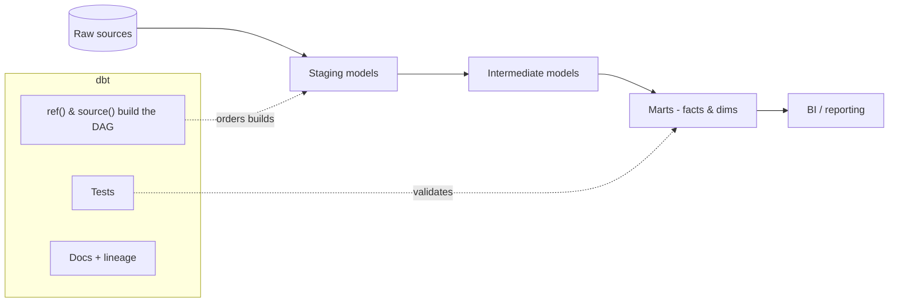

# dbt (data build tool)

dbt is the **T in ELT** — analytics engineering with software best practices:
you write `SELECT` statements as **models**, dbt handles dependencies, builds
them in the right order, tests them, and documents them. It runs *inside* your
warehouse (Snowflake, Databricks, BigQuery, etc.).

## How dbt works



- You reference other models with **`{{ ref('model_name') }}`** and raw tables
  with **`{{ source('schema','table') }}`**. dbt reads those to build a **DAG**
  and runs models in dependency order.
- `dbt run` builds models, `dbt test` runs data tests, `dbt docs generate`
  builds a lineage-aware docs site.

## Models & materializations

A model is a `.sql` file containing one `SELECT`. How it's persisted is the
**materialization**:

| Materialization | Persisted as | Use when |
|-----------------|--------------|----------|
| `view` | View | Lightweight, always fresh |
| `table` | Table (rebuilt) | Faster reads, small/medium data |
| `incremental` | Table (append/merge new rows) | Large, append-mostly data |
| `ephemeral` | Inlined CTE | Reusable logic, no object |

```sql
-- models/marts/fct_orders.sql
{{ config(materialized='incremental', unique_key='order_id') }}

SELECT
    o.order_id,
    o.customer_id,
    o.order_date,
    o.amount
FROM {{ ref('stg_orders') }} o

WHERE o.order_date > (SELECT MAX(order_date) FROM {{ this }})

```

## Tests

Catch data-quality issues in CI. Built-in generic tests + custom ones:

```yaml
# models/marts/schema.yml
models:
  - name: fct_orders
    columns:
      - name: order_id
        tests: [unique, not_null]
      - name: customer_id
        tests:
          - relationships:
              to: ref('dim_customers')
              field: customer_id
```

## Sources, seeds, macros, snapshots

- **Sources** — declare raw tables, add **freshness** checks.
- **Seeds** — small CSVs versioned in the repo (lookups).
- **Macros** — reusable Jinja SQL (DRY); packages like `dbt_utils`.
- **Snapshots** — dbt's built-in **SCD Type 2** to track history over time.

```sql
-- A simple macro

    ({{ col }} / 100.0)::numeric(16,2)

```

## Why teams adopt dbt

Version control, modular SQL, automated testing, auto-generated docs with
lineage, and environment promotion (dev → prod) — bringing software engineering
discipline to the transformation layer.

## Interview questions

??? question "What problem does dbt solve?"
    It brings engineering rigor to SQL transformations: dependency management via
    `ref()`, testing, documentation/lineage, and reproducible builds — the
    governed **T** in ELT, run inside the warehouse.

??? question "ref() vs source()?"
    `source()` points at raw external tables (and enables freshness checks);
    `ref()` points at other dbt models and is what builds the DAG and build order.

??? question "When would you use an incremental model?"
    For large, append-mostly tables where rebuilding fully is expensive — process
    only new/changed rows using `is_incremental()` and a `unique_key` for merges.

??? question "How does dbt handle slowly changing dimensions?"
    **Snapshots** implement SCD Type 2 — dbt detects changes and maintains
    valid-from/valid-to history automatically.

## Related course modules

- **[MODULE3-PYTHON](../../Course-Modules/module3-python.md)** — data pipeline
  fundamentals that complement dbt transformations.

---

## Interview deep dive

### 60-second talking points

- **"dbt is the governed T in ELT."** SQL `SELECT`s become versioned, tested,
  documented models; dbt manages dependencies and build order via `ref()`.
- **"`ref()` builds the DAG."** That single function gives you lineage,
  ordering, and environment-safe table names for free.
- **"Tests + docs make transformations trustworthy."** Data quality is enforced
  in CI, and lineage docs are auto-generated.

### Scenario & system-design questions

??? question "A nightly full rebuild of a 2-billion-row fact table takes hours. Fix it."
    Switch to an **incremental** model with a `unique_key` and an
    `is_incremental()` filter on a load/updated timestamp so only new/changed rows
    are processed and merged. Consider partition/cluster hints for the warehouse
    and periodic `--full-refresh` to correct drift.

??? question "How do you promote changes from dev to prod safely with dbt?"
    Separate **targets/profiles** per environment; develop in a dev schema, run
    **`dbt build`** (models + tests) in CI on a PR, and only merge/deploy to prod
    on green. Use **slim CI** (`state:modified`) to build just what changed.

??? question "How would you track history of a dimension that changes over time?"
    A dbt **snapshot** implements **SCD Type 2** — dbt detects changes on a key and
    maintains `dbt_valid_from`/`dbt_valid_to`, so you can query the dimension as of
    any point in time.

??? question "A model passed but downstream numbers are wrong. How do tests help?"
    Add **generic tests** (`unique`, `not_null`, `relationships`,
    `accepted_values`) and **singular tests** (custom SQL that returns failing
    rows). Test at the **grain** — e.g. assert one row per key — to catch fan-out
    from a bad join early.

### Pitfalls interviewers probe

- Hardcoding table names instead of `ref()`/`source()` → breaks lineage and envs.
- Overusing `table` materialization where `view`/`incremental` fits (cost/time).
- Incremental models without a `unique_key` → duplicates.
- No tests → silent data-quality regressions.
- Business logic duplicated across models instead of macros/intermediate models.

### Rapid-fire

| Q | A |
|---|---|
| `ref()` vs `source()`? | `ref()` = other models (builds DAG); `source()` = raw tables (+ freshness) |
| Materializations? | view, table, incremental, ephemeral |
| SCD Type 2 in dbt? | Snapshots |
| Generic vs singular test? | Generic = reusable (unique/not_null); singular = custom SQL |
| What does `dbt build` do? | Runs models + tests + snapshots + seeds in DAG order |
