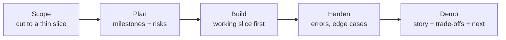

# Hackathon Build Challenges

End-to-end, time-boxed builds — the format where you ship something *working*
under pressure, then demo and defend it. Great for learning-by-doing and for the
"take-home / build day" rounds. Each challenge gives you a **scope**, **timed
milestones**, a **what-good-looks-like** bar, and **stretch goals**.

!!! tip "How to run a build challenge"
    1. **Time-box it** (2–3 hours). Set milestone alarms.
    2. **Cut scope hard** — a working thin slice beats a broken ambitious one.
       Ship the smallest thing that demos, then layer.
    3. **Keep a running README** of decisions/trade-offs — you'll present it.
    4. **Leave 15 min to demo + write "what I'd do next."** Judges reward clarity
       and honest trade-offs over feature count.

---

## The build-day method

**The #1 mistake** is over-scoping and having nothing that runs at the end.
**The #1 win** is a working, honestly-scoped demo with a clear "here's what I'd do
with more time." Decompose a vague ask into a concrete plan first, that decomposition
*is* what's being judged.

---

## Challenge 1 — RAG Q&A over a CSV (2 hours)

**Prompt:** Given a CSV of documents/records, build something that answers natural-
language questions with citations.

=== "Scope (thin slice)"

    - Load the CSV → chunk the text column.
    - Embed + store (FAISS/Chroma locally, or Cortex Search if in Snowflake).
    - Retrieve top-k for a question → prompt an LLM to answer **only from context**
      with citations.
    - A tiny CLI or Streamlit input box.

=== "Milestones"

    - **0:20** — CSV loaded, chunks created, sanity-printed.
    - **0:50** — embeddings + retrieval returning relevant chunks for a test query.
    - **1:20** — grounded answer with citations end-to-end.
    - **1:45** — a minimal UI (or clean CLI) + README.
    - **2:00** — demo + "what's next."

=== "What good looks like"

    - Answers are **grounded** (only from retrieved rows) and **cite** sources.
    - Says "not found" when the CSV doesn't cover it (no hallucination).
    - You can explain chunking + retrieval choices and one failure mode.

=== "Stretch"

    - Hybrid (vector + keyword) retrieval; a reranker.
    - A tiny eval set (5 Q/A) with recall@k.
    - Metadata filters (e.g. by category/date).

See: [RAG](../GenAI-Topics/rag/index.md) · [AI Engineer](AI_Engineer_Interview_QA.md)

---

## Challenge 2 — Ingest → transform → serve mini-pipeline (3 hours)

**Prompt:** Land raw files, transform to a clean current-state table, expose a
simple query/endpoint.

=== "Scope"

    - Ingest CSV/JSON into a **staging** table (DuckDB/SQLite/Snowflake).
    - **Idempotent** `MERGE`/upsert into a **current-state** table keyed on a
      natural key.
    - One or two data-quality checks (unique key, not-null).
    - Expose results via a small **FastAPI** endpoint or a SQL view.

=== "Milestones"

    - **0:30** — raw loaded into staging, schema confirmed.
    - **1:15** — idempotent upsert working; re-running doesn't duplicate.
    - **2:00** — quality checks + a history/snapshot table.
    - **2:40** — endpoint/view returning clean data + README.
    - **3:00** — demo (show a re-run producing no dupes).

=== "What good looks like"

    - **Re-runnable** without duplicates (prove idempotency live).
    - Clear staging → current (+ history) separation.
    - Quality checks that actually fail on bad input.

=== "Stretch"

    - CDC-style change capture; incremental instead of full load.
    - dbt models + tests instead of hand-rolled SQL.
    - A tiny dashboard over the served data.

See: [Data Engineering](DataEngineering_Interview_QA.md) ·
[SQL](SQL_Interview_QA.md) · [dbt](dbt_Interview_QA.md)

---

## Challenge 3 — Tool-using agent / MCP server (2–3 hours)

**Prompt:** Build an agent (or MCP server) that can answer questions AND take one
safe action against a small dataset/API.

=== "Scope"

    - Define 2–3 **typed tools** (e.g. `search`, `get_record`, and one gated
      `update`).
    - A **plan → act → observe** loop (LangGraph) with a step cap.
    - Read tools open; the write tool **validated + approval-gated**.
    - CLI or chat UI showing intermediate steps.

=== "Milestones"

    - **0:30** — tools defined with schemas + docstrings; callable standalone.
    - **1:15** — agent loop routes to the right tool for a question.
    - **2:00** — gated write action with validation + a confirm step.
    - **2:40** — tracing of steps + README.
    - **3:00** — demo (show it refusing an unsafe/invalid action).

=== "What good looks like"

    - Narrow, well-described tools; **destructive action is gated**, not direct.
    - Handles a bad/injection-y input safely (treats tool text as data).
    - Step cap prevents runaway loops; steps are traceable.

=== "Stretch"

    - Multi-agent supervisor routing; expose tools over **MCP**.
    - Outcome verification (confirm the action's effect against real state).
    - An eval of routing accuracy.

See: [Agents](Agents_Interview_QA.md) · [MCP](MCP_Interview_QA.md) ·
[LangChain / LangGraph](LangChain_LangGraph_Interview_QA.md)

---

## Challenge 4 — Snowflake-native GenAI (2 hours)

**Prompt:** Do something useful with data already in Snowflake, no data leaving
the account.

=== "Scope"

    - Pick a table with text; use **Cortex** LLM functions (`SUMMARIZE`,
      `CLASSIFY_TEXT`, or `AI_COMPLETE`) in SQL.
    - Or stand up a **Cortex Search** service and query it.
    - Or a minimal **Cortex Analyst** semantic model (YAML) + a NL question.

=== "Milestones"

    - **0:30** — table chosen; first Cortex function call returning results.
    - **1:15** — a small end-to-end flow (e.g. classify + summarize a batch).
    - **1:45** — wrap in a view or Streamlit-in-Snowflake page + README.
    - **2:00** — demo + governance talking point (RBAC/no egress).

=== "What good looks like"

    - Runs **in-account** (governance/no-egress story is the whole point).
    - You can explain when to use Cortex vs an external LLM.

=== "Stretch"

    - Full Snowflake-native RAG (Search → `COMPLETE`) in pure SQL.
    - Cost awareness (Cortex credits vs compute).

See: [Snowflake](Snowflake_Interview_QA.md) ·
[Technologies → Snowflake](../Technologies/snowflake/index.md)

---

## Demo & defense checklist

Judges/interviewers reward these more than raw features:

- [ ] It **runs** and demos a working slice end-to-end.
- [ ] I can state **what I cut** and why (scope discipline).
- [ ] I can name the **top failure mode** and how I'd handle it.
- [ ] I have a crisp **"what I'd do with more time."**
- [ ] I explained one **trade-off** (cost/latency/complexity).

!!! note "More labs"
    See also: [Scenario Drills](Lab_Scenario_Drills.md) ·
    [Live-Coding Drills](Lab_LiveCoding_Drills.md).
