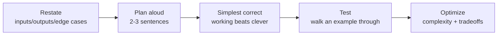

# Live-Coding Drills

Timed, hands-on coding problems for the kind of live rounds data & GenAI loops
actually use — SQL puzzles, Python data wrangling, a pipeline function, and a
small LangChain/agent task. Not LeetCode tricks; **production-shaped** problems
where they watch *how you think*.

!!! tip "How to practice"
    1. Start a timer (**15–20 min** per drill). Read the prompt, don't peek.
    2. **Narrate**: restate → plan out loud → simplest correct version → test →
       optimize. Talking through it is half the score.
    3. Only then open the **solution** and compare approach, not just output.
    4. Redo any you couldn't finish clean, from scratch.

---

## The live-coding method (use every time)



The panic comes from having no routine. This *is* the routine. Interviewers score
your reasoning and recovery, not a perfect first draft. Think out loud even when
stuck; silence reads as panic, reasoning reads as competence.

---

## SQL drills

??? question "Second-highest salary per department (handle ties)."
    **Clarify:** should ties share the rank? (Usually yes → `DENSE_RANK`.)

    ```sql
    -- Starter: employees(employee, department, salary)
    SELECT department, employee, salary
    FROM (
      SELECT department, employee, salary,
             DENSE_RANK() OVER (PARTITION BY department
                                ORDER BY salary DESC) AS rnk
      FROM employees
    )
    WHERE rnk = 2;
    ```

    **Why:** `DENSE_RANK` so tied #1s still leave a #2 (no gap). `ROW_NUMBER` would
    arbitrarily pick one; `RANK` would skip position 2 when #1 is tied. The choice
    *is* the interview — say why out loud.

??? question "Deduplicate rows, keeping the most recent per key."
    ```sql
    -- Starter: events(id, natural_key, payload, updated_at)
    SELECT id, natural_key, payload, updated_at
    FROM (
      SELECT e.*,
             ROW_NUMBER() OVER (PARTITION BY natural_key
                                ORDER BY updated_at DESC) AS rn
      FROM events e
    )
    WHERE rn = 1;   -- or QUALIFY rn = 1 in Snowflake
    ```

    **Gotcha:** `DISTINCT` can't choose *which* duplicate to keep; `GROUP BY` forces
    an aggregate on every column. `ROW_NUMBER` picks deterministically. Mention the
    tie-break if `updated_at` isn't unique (add a secondary sort key).

??? question "Consecutive-day streaks per user (gaps & islands)."
    ```sql
    -- Starter: activity(user_id, day)   one row per active day
    SELECT user_id, MIN(day) AS start_day, MAX(day) AS end_day, COUNT(*) AS len
    FROM (
      SELECT user_id, day,
             DATEADD('day',
               -ROW_NUMBER() OVER (PARTITION BY user_id ORDER BY day), day) AS grp
      FROM activity
    )
    GROUP BY user_id, grp;
    ```

    **Insight:** for consecutive dates, `day - ROW_NUMBER()` is constant within a
    run — that constant becomes the group key. Explain that trick; it's the whole
    point of the problem.

---

## Python drills

??? question "Flatten an arbitrarily nested list."
    ```python
    def flatten(items):
        out = []
        for x in items:
            if isinstance(x, list):
                out.extend(flatten(x))   # recurse
            else:
                out.append(x)
        return out

    flatten([1, 2, [3, 4, ["a", "b"], 5]])  # [1,2,3,4,'a','b',5]
    ```

    **Talk about:** recursion vs an explicit stack (avoids deep-recursion limits);
    a generator version (`yield from`) for memory. Mention you'd type-check for
    tuples too if the spec allows them.

??? question "Group records by a key without pandas."
    ```python
    from collections import defaultdict

    def group_by(rows, key):
        out = defaultdict(list)
        for r in rows:
            out[r[key]].append(r)
        return dict(out)

    # rows = [{"dept":"A","name":"x"}, {"dept":"B","name":"y"}, ...]
    ```

    **Why `defaultdict`:** avoids the `if key not in dict` boilerplate. If asked to
    aggregate (sum/count), swap the list for a running total. Note O(n) single pass.

??? question "Make N API calls concurrently, safely."
    ```python
    import asyncio, aiohttp

    async def fetch(session, url, sem):
        async with sem:                              # cap concurrency
            async with session.get(url, timeout=10) as r:
                return await r.text()

    async def main(urls):
        sem = asyncio.Semaphore(50)
        async with aiohttp.ClientSession() as s:
            return await asyncio.gather(
                *(fetch(s, u, sem) for u in urls),
                return_exceptions=True,              # one failure ≠ whole batch
            )
    ```

    **Talk about:** I/O-bound → concurrency not parallelism (GIL is fine here);
    the semaphore prevents socket exhaustion / rate-limit trips; `timeout` and
    `return_exceptions` for resilience; add retry-with-backoff for transient errors.

??? question "Stream-process a file too big for memory."
    ```python
    def count_by_prefix(path, n=3):
        from collections import Counter
        c = Counter()
        with open(path, "r", encoding="utf-8") as f:
            for line in f:                # lazy: one line at a time
                key = line[:n]
                c[key] += 1
        return c
    ```

    **Why:** iterating the file object streams line-by-line — flat memory. Contrast
    with `f.read().splitlines()` which loads everything. For CSV, mention
    `pandas.read_csv(chunksize=...)` or PyArrow row groups.

---

## Pipeline / GenAI drills

??? question "Write an idempotent upsert (so retries don't duplicate)."
    ```sql
    -- MERGE keyed on a natural/surrogate key = safe to re-run
    MERGE INTO current.orders tgt
    USING staging.orders src ON tgt.order_id = src.order_id
    WHEN MATCHED AND src.op = 'D' THEN DELETE
    WHEN MATCHED THEN UPDATE SET tgt.amount = src.amount, tgt.updated = src.ts
    WHEN NOT MATCHED THEN INSERT (order_id, amount, updated)
      VALUES (src.order_id, src.amount, src.ts);
    ```

    **Talk about:** idempotency = re-running yields the same result. Keyed `MERGE`
    (not blind `INSERT`), atomic write, checkpoint. This is what makes retries and
    backfills safe — a senior signal.

??? question "Chunk text for RAG with overlap."
    ```python
    def chunk(text, size=800, overlap=120):
        words = text.split()
        step = size - overlap
        return [" ".join(words[i:i + size])
                for i in range(0, len(words), step)]
    ```

    **Talk about:** overlap preserves context across boundaries; prefer *semantic*
    splits (paragraphs/sections) over fixed size when possible; too large → diluted
    relevance, too small → lost context. Tie choice to an eval set.

??? question "Define one safe agent tool (typed, gated)."
    ```python
    from langchain_core.tools import tool

    @tool
    def get_order(order_id: str) -> dict:
        """Fetch an order by ID. READ-ONLY. Returns minimal fields."""
        return db.fetch_order(order_id)   # trimmed, structured output

    @tool
    def refund_order(order_id: str, amount_cents: int) -> dict:
        """Issue a refund. WRITE — requires prior human approval.
        amount_cents must be <= original charge."""
        assert amount_cents <= db.charge_of(order_id)   # server-side validation
        return db.refund(order_id, amount_cents)
    ```

    **Talk about:** narrow + typed + clear docstring (the model reads it); read vs
    write separated; destructive action validated server-side and gated. Treat any
    tool/retrieved text as data, not instructions (injection).

---

## Self-check after each drill

- [ ] Did I restate the problem and confirm edge cases before coding?
- [ ] Did I state complexity (time/space) out loud?
- [ ] Working-but-simple first, then optimize?
- [ ] Did I test with a concrete example?
- [ ] Could I explain one trade-off or alternative approach?

!!! note "More labs"
    See also: [Scenario Drills](Lab_Scenario_Drills.md) ·
    Hackathon build challenges (next). Concept refreshers:
    [SQL](SQL_Interview_QA.md) · [Python](Python_Interview_QA.md) ·
    [AI Engineer](AI_Engineer_Interview_QA.md).
