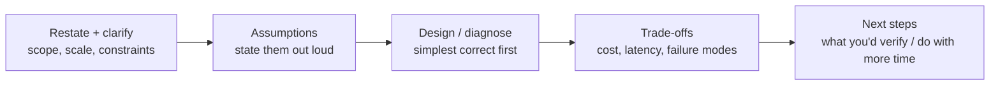

# Scenario Drills — Data & GenAI

Open-ended, real-world scenarios for **system design** and **"it broke in
production"** situations — the parts of interviews (and the job) that trivia
can't prepare you for. Each drill gives you the prompt, a **framework to attack
it**, a reference walkthrough, and **curveballs** the interviewer (or reality)
will throw next.

!!! tip "How to practice"
    1. Read the **prompt** and set a timer (10–15 min).
    2. **Think out loud** — talk through your approach before peeking.
    3. Reveal the **framework**, then the **walkthrough**; compare to yours.
    4. Handle the **curveballs** without looking. That's the real test.
    Related concept pages are linked at the bottom of each drill.

---

## How to attack any scenario

A repeatable structure beats memorized answers. Use this every time:

- **Clarify before solving.** Scale? Latency target? Batch or real-time? Budget?
- **State assumptions** so a wrong one is cheap to correct.
- **Simplest correct design first**, then optimize — same as live coding.
- **Name trade-offs** — that's what separates senior from junior.
- **Say how you'd verify** — metrics, tests, a canary. Shows operational maturity.

---

## System-design drills

??? question "Design a near-real-time Oracle → Snowflake pipeline that keeps history."
    **Clarify first:** latency target (minutes? seconds?), volume, do we need
    hard deletes, how much history to retain.

    **Framework → walkthrough:**
    1. **Extract:** log-based **CDC** (not full-table polling) — low source load,
       captures updates + deletes.
    2. **Land:** raw change events append to a **bronze/staging** table.
    3. **Merge:** scheduled `MERGE` upserts latest per key into a **current-state**
       table; prior versions archived to a **timestamped history** table (SCD2).
    4. **Idempotent:** keyed upserts + checkpoints so retries/backfills don't
       duplicate.
    5. **Quality gates:** uniqueness/freshness tests before publish; bad rows to a
       dead-letter table.
    6. **Serve:** current for ops, history for audit, a view/`UNION` for the full
       picture. Tag history for compliance.

    **Trade-offs:** Streams+Tasks (imperative, custom logic) vs Dynamic Tables
    (declarative, less code) vs Snowpipe Streaming (lowest latency, more cost).

    **Curveballs:**
    - *"Source has no reliable `updated_at`."* → log-based CDC, not query-based.
    - *"Late-arriving data."* → lookback window on the merge, not just `> MAX(ts)`.
    - *"Cost doubled."* → check warehouse auto-suspend, Snowpipe on tiny files.

    See: [Data Engineering](../Personal-SourceCode/DataEngineering_Interview_QA.md) ·
    [Snowflake](../Personal-SourceCode/Snowflake_Interview_QA.md)

??? question "Design a production RAG assistant over a company's internal docs."
    **Clarify:** how many docs, how often they change, do answers need citations,
    latency/cost budget, on-prem/governance constraints.

    **Framework → walkthrough:**
    1. **Ingest + chunk** docs to semantic units (sections, not fixed tokens).
    2. **Embed + index** — hybrid (vector + keyword) so exact terms aren't lost.
    3. **Retrieve top-k → rerank** for precision; apply metadata filters.
    4. **Assemble context** within the token budget; instruct "answer only from
       context, cite sources, say 'not found' otherwise."
    5. **Generate** with low temperature; **validate** citations.
    6. **Guardrails + eval:** injection defense, an eval set (recall@k, faithfulness),
       feedback capture, quality-drift monitoring.

    **Trade-offs:** self-managed vector DB vs managed (e.g. Cortex Search);
    one big model vs routing cheap→expensive.

    **Curveballs:**
    - *"It cites the wrong doc."* → retrieval problem first (log top-k), not prompting.
    - *"Docs change hourly."* → incremental re-index / target-lag, not full rebuild.
    - *"Data can't leave our account."* → in-warehouse (Cortex) or VPC-private inference.

    See: [RAG](../GenAI-Topics/rag/index.md) ·
    [AI Engineer](../Personal-SourceCode/AI_Engineer_Interview_QA.md)

??? question "Design a multi-agent assistant that answers questions AND takes actions."
    **Clarify:** which actions (read vs write?), how reversible, who approves,
    latency tolerance.

    **Framework → walkthrough:**
    1. **Supervisor** plans and routes to specialists (data / docs / actions).
    2. **Tools**: narrow, typed, least-privilege; read tools open, **write tools
       gated** behind validation + human approval.
    3. **Loop**: plan → act → observe with a **step cap** and cost budget.
    4. **Grounding**: tools return real data; treat tool output as untrusted.
    5. **Guardrails + tracing**: every step logged; outcome verified vs real state.

    **Trade-offs:** single agent (simpler, reliable) vs multi-agent (only when
    domains genuinely differ). Orchestrate as a graph (LangGraph) for durable
    state + human-in-the-loop.

    **Curveballs:**
    - *"It looped forever."* → step cap + repeated-action detection.
    - *"It deleted something it shouldn't."* → destructive actions must be
      propose-then-approve, never direct.
    - *"A tool result said 'ignore your instructions'."* → injection; data ≠ commands.

    See: [Agents](../Personal-SourceCode/Agents_Interview_QA.md) ·
    [MCP](../Personal-SourceCode/MCP_Interview_QA.md)

??? question "Design a metrics/BI layer that stays fast as data grows 100x."
    **Clarify:** query patterns, freshness needs, number of concurrent users,
    biggest tables.

    **Framework → walkthrough:**
    1. **Model** as star schema (facts + conformed dims) for predictable joins.
    2. **Pre-aggregate** heavy rollups (materialized/dynamic tables) so dashboards
       don't scan raw.
    3. **Cluster/partition** big fact tables on the dominant filter (usually date).
    4. **Isolate workloads** — separate warehouses for ETL vs BI so they don't
       contend; multi-cluster for concurrency spikes.
    5. **Cache** — result cache + BI extract layer for repeated queries.

    **Trade-offs:** precompute freshness vs cost; wide tables vs normalized.

    **Curveballs:**
    - *"A dashboard got slow after 10x growth."* → Query Profile: pruning, spill,
      exploding joins.
    - *"Costs spiked."* → resource monitors, auto-suspend, kill `SELECT *`.

    See: [Snowflake](../Personal-SourceCode/Snowflake_Interview_QA.md) ·
    [SQL](../Personal-SourceCode/SQL_Interview_QA.md)

---

## "It broke in production" drills

??? question "The nightly pipeline's cost doubled overnight. Diagnose it."
    **Attack:** don't guess — measure. Rank credit/compute burn by warehouse and
    query (`WAREHOUSE_METERING_HISTORY`, `QUERY_HISTORY`). Common causes: a
    warehouse with auto-suspend too high (idle burn), multi-cluster scaling out, a
    full-scan report running frequently, Snowpipe on many tiny files, or a backfill
    someone kicked off. **Fix + prevent:** tighten auto-suspend, resource monitors
    with alerts, workload isolation, right-size. **Say how you'd confirm:** compare
    today's top queries to last week's.

    See: [Snowflake](../Personal-SourceCode/Snowflake_Interview_QA.md)

??? question "A Spark job passed on sample data but hangs at full scale."
    **Attack:** almost always **data skew** in a shuffle. Open the Spark UI, one
    task processes far more than the rest. **Fix:** enable AQE skew-join;
    **broadcast** the small side to skip the shuffle; **salt** the hot key if still
    skewed. Also check partition sizing (~100–200 MB) and spill. **Verify:** re-run,
    watch the long stage's task distribution flatten.

    See: [Databricks](../Personal-SourceCode/Databricks_Interview_QA.md)

??? question "Your incremental model silently drops rows. Find the bug."
    **Attack:** row counts lower than source → usually the watermark or the key.
    (1) Watermark uses `> MAX(updated_at)` but a **late-arriving** row has an older
    timestamp → add a **lookback window**. (2) Non-unique `unique_key` collapses
    rows in the merge → pick a truly unique/surrogate key. (3) Schema drift dropped
    a column → set `on_schema_change`. **Verify:** `--full-refresh` rebuild + a
    row-count reconciliation test.

    See: [dbt](../Personal-SourceCode/dbt_Interview_QA.md)

??? question "A deploy broke prod and users are affected. What do you do?"
    **Attack, in order:** (1) **Restore service first** — roll back / flip
    blue-green. Confirm recovery on dashboards. Don't debug a burning prod. (2)
    **Then investigate** with logs/traces around the change window. (3) **Prevent
    recurrence:** smaller deploys, canary with auto-rollback, feature flags to
    decouple deploy from release. (4) **Blameless postmortem.** The instinct to
    debug-before-restore is the classic junior mistake.

    See: [DevOps](../Personal-SourceCode/DevOps_Interview_QA.md)

??? question "The LLM feature is too slow and too expensive. Cut both."
    **Attack — levers:** model **routing** (cheap model for easy cases), **caching**
    (exact + semantic), **prompt/context trimming** (retrieve less, compact
    history), **batching**, and **streaming** to cut *perceived* latency. Tokens =
    cost + latency, so right-size context. **Verify:** measure per-request cost/
    latency before and after; optimize the top offenders, not everything.

    See: [AI Engineer](../Personal-SourceCode/AI_Engineer_Interview_QA.md)

---

## Self-check

After a drill, can you answer these about *your* solution?

- [ ] What did I clarify before designing?
- [ ] What assumptions did I state?
- [ ] What's the simplest correct version, and how would I optimize?
- [ ] What are the top 2 failure modes and how do I handle them?
- [ ] How would I *verify* it works (metric, test, canary)?

!!! note "More labs"
    This is the Scenario track. Live-coding drills and hackathon build challenges
    are coming as separate Practice Labs pages.
