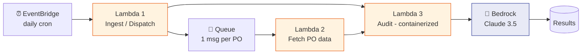
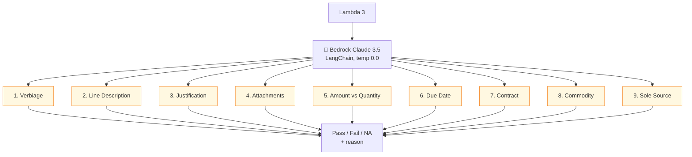
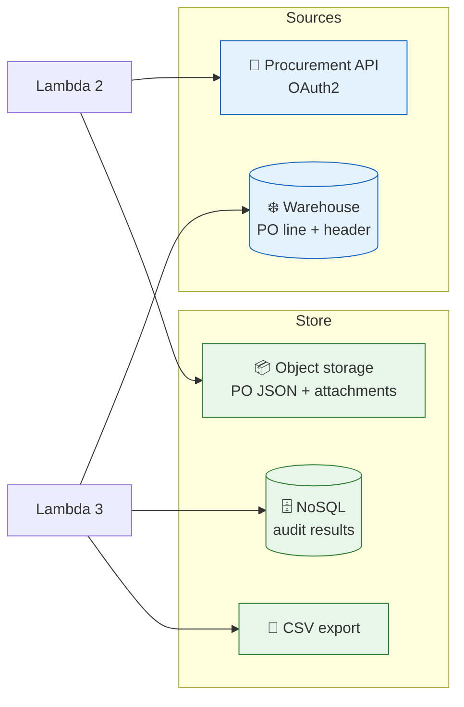
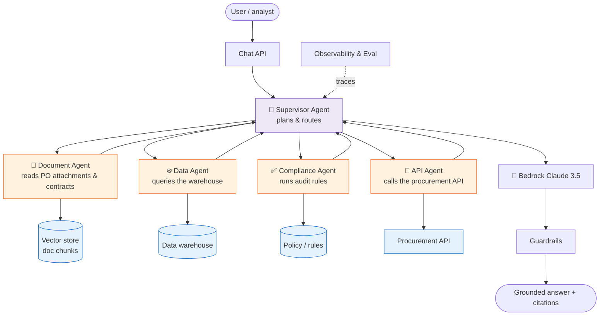

# GenAI Procurement Audit Bot — Architecture

A serverless, event-driven pipeline that audits purchase orders with an LLM. This
is a **generalized reference architecture** — internal names, endpoints, and
identifiers are omitted.

*The architecture is shown in three readable parts below: the pipeline, the LLM
audit, and the data/storage layout.*

### Part 1 — The pipeline (trigger → fetch → audit)



### Part 2 — The 9-point LLM audit



### Part 3 — Data & storage



## Key design details

| Component | Value |
|-----------|-------|
| LLM Model | Claude 3.5 Sonnet (via Amazon Bedrock) |
| Bedrock Access | Private VPC endpoint (config in Parameter Store) |
| Region | us-west-2 |
| LLM Framework | LangChain (`ChatBedrock`, `LLMChain`, `PromptTemplate`) |
| Temperature | 0.0 (deterministic auditing) |
| Parallelism | ThreadPoolExecutor, ~40 workers, chunked |
| Results store | NoSQL table + CSV export |
| Packaging | Container image on a serverless runtime |
| Schedule | Daily (EventBridge) |

## Data flow

```
EventBridge (daily)
  → Lambda 1 → Warehouse (get new PO list) → Queue
  → Lambda 2 → Procurement API (fetch PO data) → Object storage
  → Lambda 3 → Object storage (read PO JSON) + Warehouse (PO details)
             → Bedrock Claude 3.5 Sonnet (9 audit checks via LangChain)
             → NoSQL + CSV (save audit results)
```

## 9-Point AI Audit Checklist
1. **Verbiage** — Is requisition header verbiage adequate?
2. **Line Description** — Does each line have a proper description?
3. **Justification** — Is business justification provided?
4. **Attachments** — Are required attachments present?
5. **Amount vs Quantity** — Is a service PO submitted correctly (Amount vs Qty)?
6. **Due Date** — Is the need-by date after the PO create date?
7. **Contract** — Is a contract referenced where required?
8. **Commodity** — Is the commodity code appropriate?
9. **Sole Source** — Is the sole-source memo justified?

Each check returns **Pass / Fail / NA** with a reason.

## Why this design

- **Fan-out with a queue** — one message per PO keeps the audit Lambda simple,
  parallel, and retry-safe (idempotent per PO).
- **Deterministic auditing** — temperature 0.0 so the same PO yields the same
  verdict; the checklist is a structured prompt returning Pass/Fail/NA + reason.
- **Grounded** — the LLM audits against real PO data pulled from the warehouse and
  API, not from memory.
- **Private inference** — Bedrock via a VPC endpoint keeps data in-boundary.

## GenAI design deep dive

The GenAI decisions that make this reliable — useful as a study/interview example:

### Structured, deterministic prompting

Each audit check is a **structured prompt** that must return a fixed shape, so
downstream code can parse it and store Pass/Fail/NA:

```text
System: You are a procurement compliance auditor. Answer ONLY from the PO data
provided. If information is missing, return NA — never guess.

Given this PO line data:
{po_json}

Check: Is a business justification provided and adequate?
Return JSON only: {"result": "Pass|Fail|NA", "reason": "<one sentence>"}
```

- **Temperature 0.0** → same PO, same verdict (auditable, repeatable).
- **JSON-only output** → parsed and validated; a bad parse triggers a retry.
- **"NA, never guess"** → prevents hallucinated compliance verdicts.

### Grounding, not memory

The model never audits from its own knowledge — it's given the **actual PO
line/header data** (from the warehouse) plus attachments/comments (from the API).
This is retrieval-style grounding: the facts come from your systems, the model
only *reasons* over them. See [RAG](../GenAI-Topics/rag/index.md).

### Batching & parallelism

- POs are independent → audited **in parallel** (thread pool, chunked) for
  throughput.
- Each PO's 9 checks can be one call (all checks in a single structured prompt)
  or split — a **cost/latency vs granularity** trade-off (see
  [Cost Optimization](../GenAI-Topics/cost-optimization/index.md)).

### Evaluation & guardrails

- **Eval set** of hand-labeled POs measures audit accuracy per check before
  changing the model or prompt (see
  [Observability & Eval](../GenAI-Topics/observability/index.md)).
- **Output guardrails** ensure only valid Pass/Fail/NA leaves the pipeline.
- **Human-in-the-loop** for Fails — a person reviews before action; the bot
  flags, it doesn't auto-reject.

### What could go wrong (and the fix)

| Risk | Mitigation |
|------|------------|
| Hallucinated "Pass" on missing data | "Return NA if missing; never guess" + eval |
| Inconsistent verdicts | Temperature 0.0 + structured output |
| Prompt injection via PO free-text | Treat PO text as data, not instructions |
| Cost spikes on volume | Batch checks per call, cache, right-size model |
| Silent quality drift on model upgrade | Pin version, re-run eval set before switching |

---

# Astra — Multi-Agent Procurement Assistant

**Astra** is a conversational, **multi-agent** evolution of the batch auditor
above. Instead of one Lambda running a fixed 9-point checklist, a **supervisor
agent** routes a user's request to specialist agents that each own a domain, then
composes the answer.



## How Astra differs from the batch bot

| | Procurement Audit Bot | Astra (multi-agent) |
|-|----------------------|---------------------|
| Interaction | Batch, scheduled | Conversational, on-demand |
| Structure | One Lambda, fixed checklist | Supervisor + specialist agents |
| Flexibility | Fixed 9 checks | Handles open-ended questions |
| Retrieval | Direct queries | RAG + tools per agent |
| Pattern | Pipeline | Agent orchestration (A2A) |

## The agents

| Agent | Responsibility | Tools |
|-------|----------------|-------|
| **Supervisor** | Understand intent, plan, route, compose | (delegates) |
| **Document Agent** | Read PO attachments, contracts | Vector search (RAG) |
| **Data Agent** | Answer numeric/status questions | Warehouse SQL (read-only) |
| **Compliance Agent** | Apply audit rules to a PO | Rules + LLM reasoning |
| **API Agent** | Fetch live PO/vendor data | Procurement REST API |

## Design principles (Astra)

- **Supervisor + specialists** — each agent has a narrow, well-described tool set;
  the supervisor decides who to call (see
  [Agent Engineering](../GenAI-Topics/agent-engineering/index.md) and
  [A2A Communication](../GenAI-Topics/a2a/index.md)).
- **Least privilege** — read-only data/API tools; any write action is gated.
- **Grounded + cited** — answers cite the PO lines / documents used.
- **Guardrails + tracing** — every request is traced and passes output guardrails
  (see [Observability & Eval](../GenAI-Topics/observability/index.md)).

> Astra is illustrative — a generalized multi-agent design, not tied to any
> specific internal system.
